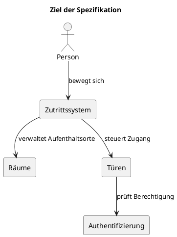
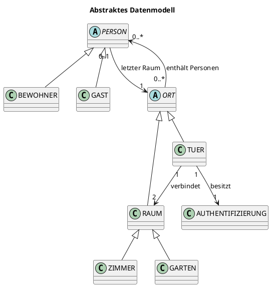
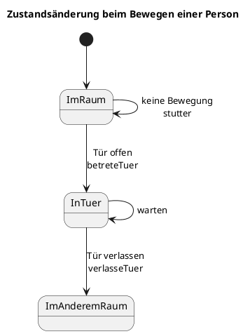
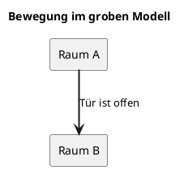
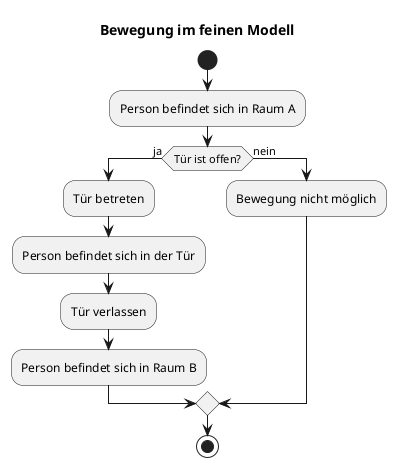
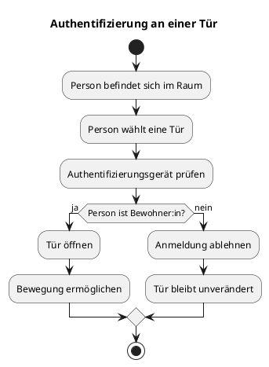
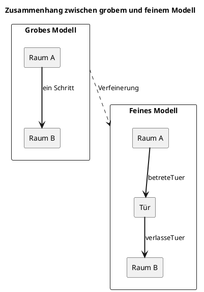

## Einleitung und Ziel der Arbeit

In dieser Arbeit wird ein System modelliert, in dem sich Personen zwischen verschiedenen Räumen bewegen können. Der Zugang zu einzelnen Räumen erfolgt über Türen. Türen können geöffnet oder geschlossen sein und benötigen gegebenenfalls eine Authentifizierung.

Das System wird auf zwei Abstraktionsebenen beschrieben:

1. Im groben Modell bewegen sich Personen direkt von einem Raum in einen anderen.
2. Im feinen Modell durchqueren Personen zunächst die Tür und befinden sich für einen Übergangszustand innerhalb der Tür.

Mithilfe von Alloy werden mögliche Systemzustände und Abläufe automatisch untersucht. Lean wird verwendet, um ausgewählte Eigenschaften mathematisch beziehungsweise formal zu beweisen.



## Fachliche Beschreibung des Systems

In diesem Kapitel wird das System zunächst ohne formale Notation erklärt.

### Beteiligte Elemente

| Element | Bedeutung |
| :--- | :--- |
| Person | Eine Person, die sich im System bewegt |
| Bewohner:in | Eine Person mit dauerhafter Berechtigung für den Zutritt |
| Gast | Eine Person ohne dauerhafte Berechtigung |
| Raum | Ein Bereich, in dem sich Personen aufhalten können |
| Zimmer | Ein spezieller Raum |
| Garten | Ein spezieller Raum mit genau einem Zugang |
| Tür | Verbindet zwei Räume |
| Authentifizierung | Technische Einrichtung zur Identitäts- oder Berechtigungsprüfung |

### Grundregeln
Die wichtigsten Grundregeln sollten als verständliche Anforderungen formuliert werden:

* Es gibt genau einen Garten.
* Jede Person befindet sich immer genau an einem Ort.
* Eine Tür verbindet genau zwei Räume.
* Eine Tür kann geöffnet oder geschlossen sein.
* Eine Person darf eine Tür nur bei geöffneter Tür passieren.
* Das grobe und das feine Modell sollen konsistente Ergebnisse liefern.
* Der Garten besitzt genau einen Zugang zum Haus.
* Der Bewegungszustand darf keine Teleportation ermöglichen.

## Raumplan und räumliche Struktur

Ein beispielhafter Raumplan könnte so aussehen: 


Darin gibt es nun Räume ... Todo beschreiben (alles betretbar, büros nur teils betretbar, türen geschlossen etc, bernd aufnehmen als beispiel)

## Abstraktes Datenmodell

Hier wird erklärt, aus welchen Objekten das System besteht und wie diese zusammenhängen.

### Klassen- und Beziehungsdiagramm



**Personen**:
PERSON beschreibt die allgemeine Menge aller Personen. Bewohner:innen und Gäste sind spezielle Arten von Personen. Das Feld `letzterRaum` speichert den letzten Raum, in dem sich eine Person befunden hat.

**Orte**:
Ein Ort kann Personen enthalten und Nachbarn besitzen. Das Feld `nachbarn` beschreibt, welche Orte miteinander verbunden sind.

**Türen und Räume**:
Räume und Türen sind beide Orte. Dadurch können Personen im feinen Modell vorübergehend auch innerhalb einer Tür dargestellt werden. Eine Tür besitzt einen Öffnungszustand und genau ein Authentifizierungsgerät.

## Zeit und Zustandsänderungen TODO

Das System besteht dabei nicht nur aus einem unveränderlichen Zustand, sondern aus einer Folge von Zuständen:

```text
Zustand 0  -- Bewegung -->  Zustand 1  -- Tür schließen --> Zustand 2

todo als Bild beschreiben
```

Beispielsweise möchte Bernd das Zimmer 1 betreten ... TODO

Es muss daher möglich sein das System dahingehend zu modellieren. Für diese Modellierung nach Zuständen nutzen wir das Event B Modell/ Zustände ??

**PlantUML-Zustandsdiagramm**



Wir haben daher unser Modell in verschiedene Verfeinerungsstufen eingeteilt. Deren Details und Erklärungen folgen nun.

## Grobes Modell
Das grobe Modell beschreibt Bewegungen auf einer vereinfachten Ebene.

Im groben Modell wird eine Bewegung direkt als Wechsel von einem Raum in einen anderen dargestellt. Die Tür wird dabei nicht als eigener Zwischenaufenthaltsort betrachtet. Es wird lediglich geprüft, ob eine geeignete offene Tür zwischen beiden Räumen existiert.

**Beispiel**

Bernd kann hier also ... TODO

**Diagramm**



In diesem Schritt ändern sich nur die Aufenthaltsmengen der beiden beteiligten Räume. Andere Räume, Türen und der letzte bekannte Raum einer Person bleiben unverändert.

## Feines Modell

Das feine Modell stellt den Bewegungsablauf detaillierter dar. Eine Person bewegt sich in zwei Schritten:

1. Die Person betritt eine Tür.
2. Die Person verlässt die Tür und betritt den Zielraum.

**Beispiel**

Bernd kann hier also ... TODO

**Ablaufdiagramm**



Die Bewegung ist damit in zwei Schritte aufgeteilt worden, nämlich in **betreteTuer** und **verlasseTuer**:

Das Prädikat `betreteTuer` beschreibt den ersten Teil der Bewegung. Die Person muss sich im Ausgangsraum befinden, die Tür muss Nachbar des Raums sein und geöffnet sein. Anschließend wird die Person aus dem Raum entfernt und in die Tür aufgenommen.

Das Prädikat `verlasseTuer` beschreibt den zweiten Teil der Bewegung. Die Person muss sich in der Tür befinden. Der Zielraum muss mit der Tür verbunden sein. Danach wird die Person aus der Tür entfernt und in den Zielraum aufgenommen.

## Feineres Modell: Authentifizierung und Türsteuerung

Eine weitere Verfeinerungsstufe schaut sich nun die Authentifizierung an...

**Beispiel**

Bernd erklärt die unten stehenden Regeln...TODO

* Nur Bewohner:innen können sich anmelden.
* Eine Anmeldung erfolgt an einer Tür.
* Bei erfolgreicher Anmeldung wird die Tür geöffnet.
* Bei einer fehlgeschlagenen Anmeldung bleibt der Zustand unverändert.
* Das Öffnen einer Tür verändert keine anderen Türen.

**Aktivitätsdiagramm**



Die Dokumentation sollte anschließend erklären, welche Teile Vorbedingungen, Nachbedingungen und Frame Conditions sind TODO.

| Bereich | Bedeutung |
| :--- | :--- |
| **Vorbedingung** | Was vor der Aktion gelten muss |
| **Nachbedingung** | Was nach der Aktion gilt |
| **Frame Condition** | Was unverändert bleibt |

## Systemgarantien

In diesem Kapitel werden die Eigenschaften beschrieben, die immer gelten sollen.

- Das System enthält zu jedem Zeitpunkt genau einen Garten.
- Jede Person muss sowohl im groben als auch im feinen Modell immer genau einem Ort zugeordnet sein.
- Jede Tür besitzt genau zwei benachbarte Räume. Sie verbindet also einen Ausgangsraum mit einem Zielraum.
- TODOs

## Konsistenz zwischen den Modellen

**Grundidee**
Das grobe Modell überspringt den Aufenthalt in der Tür:

```text
Raum A  -------------------->  Raum B
```

Das feine Modell bildet denselben Vorgang detaillierter ab:

```text
Raum A  ---->  Tür  ---->  Raum B
```

Das verfeinerte dritte Modell widerum bildet noch eine Authentifizierung bei der Tür ab:

```text
Raum A  ---->  Tür (Authentifizierung nötig)  ---->  Raum B
```

**Abbildung**



Jeder zulässige Ablauf im feinen Modell muss daher mit dem groben Modell vereinbar sein. Der zusätzliche Zwischenzustand innerhalb der Tür darf also nicht zu einem anderen fachlichen Ergebnis führen. Die Verfeinerung ist erfolgreich, wenn beide Modelle nach Abschluss einer Bewegung dieselbe Raumzuordnung der Personen liefern.

## Fazit und Ausblick

Das Fazit sollte beantworten: TODO
* Was wurde modelliert?
* Welche Eigenschaften wurden überprüft?
* Welche Rolle spielen Alloy und Lean?
* Welche Erweiterungen wären möglich?

**Mögliche Erweiterungen:**
* mehrere Gärten oder Außenbereiche
* unterschiedliche Berechtigungsstufen
* mehrere Authentifizierungsgeräte
* Türen mit automatischem Schließen
* gleichzeitige Bewegungen mehrerer Personen
* Alarmzustände bei unberechtigtem Zutritt
* zusätzliche Raumtypen
* vollständige formale Beweise der Verfeinerung