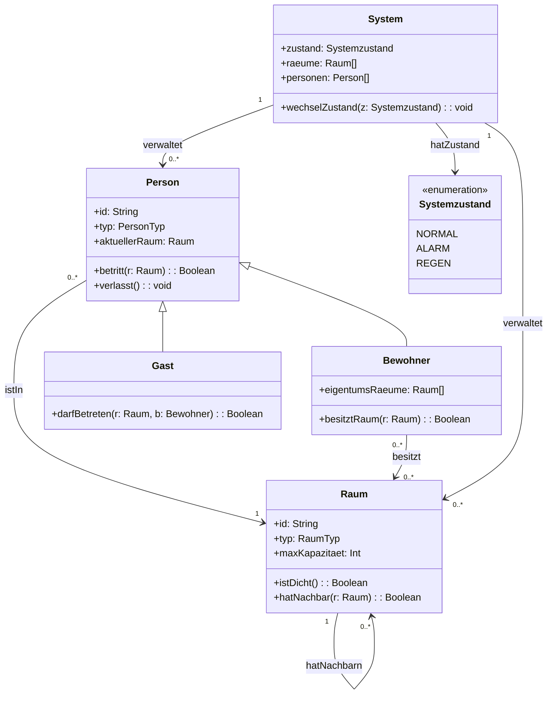

# Smart Home Model Specification

## Ziel

Dieses Dokument beschreibt die fachliche Modellierung des Smart-Home-Systems unabhängig von der konkreten Alloy- oder Lean-Implementierung nach dem Event-B Vorgehen.

# 1. Anwesenheitserkennung & Zutrittskontrolle
TODO: 
- Diagramme mit Mermaid hinzufügen: UML-Diagramme, Entity-Relationship-Modell (Livia)
- Allergröbstes Modell in Alloy (Verena)
- Allergröbstes Modell in Lean (David)
- Karte malen (David)

### Allergröbstes Modell

- Es gibt Räume.
- Räume haben Nachbarräume.
- Symmetrie: Räume haben sich gegenseitig als Nachbarn. 
- Räume haben sich selbst nicht zum Nachbarn.
- Räume sind eindeutig identifizierbar.
- Räume sind statisch. Sie bleiben an ihrer Raum-Topologie-Stelle.

## Gröbstes Modell

- Es gibt Personen.
- Eine Person kann nur in einem Raum zu Zeitpunkt T sein.
- Personen können zwischen Räumen hin und her wechseln (Räume können von Personen betreten werden).
- Raumwechsel von Personen sind nur in benachbarten Räumen möglich.

## Grobes Modell

- Ein Raum kann nur von Y* Personen besessen werden.
- Eine Person kann bis zu X* Räume besitzen.
- Ein Raum kann maximal Z* Personen fassen.

z.B. Funktion: Person ist in Raum A und geht in Raum B. Sie wird dann aus Raum A entfernt und Raum B bekommt +1 Person.

### Feineres Modell

- Eine Person kann ein Gast sein.
- Ein Bewohner ist eine Person die sowohl einen Raum besitzt als auch andere Räume besuchen kann.
- Es gibt Räume in Gäste niemals kommen können.
- Es gibt Räume die Gäste nur mit Besitzer betreten können.

### Außnahmenzustands-Modell

- Es gibt verschiedene Außnahmezustände.
- Tritt der Zustand-Alarmzustand ein, dürfen Personen den Raum in dem sie sich gerade befinden, nicht mehr verlassen.
- Räume bestehen aus dichten Räumen (mit Dach) und Gärten.
- Jeder Garten hat mindestens einen dichten Raum als Nachbar.
- Tritt der Zustand-Regen ein, müssen alle Personen in einem dichten Raum sein. Gärten müssen verlassen werden.
(- Tritt der Zustand-Feuer ein, tritt das Gegenteil von Zustand-Regen ein)

# Anmerkungen zur Notation

- X* := X kann Werte zwischen 0 und unendlich annehmen