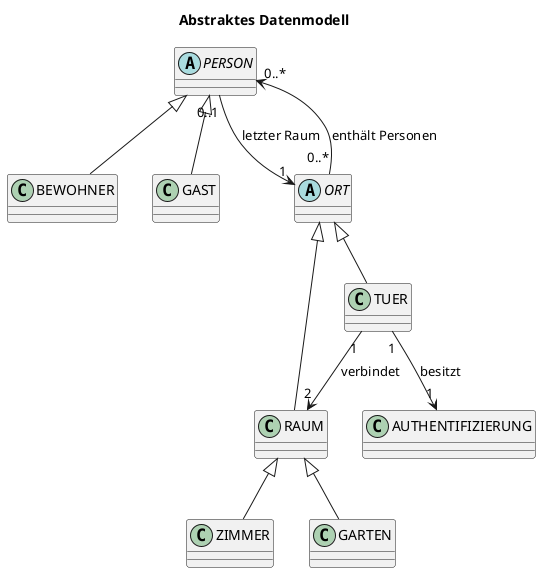
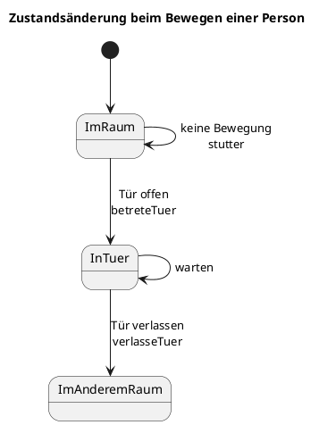
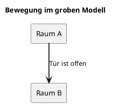
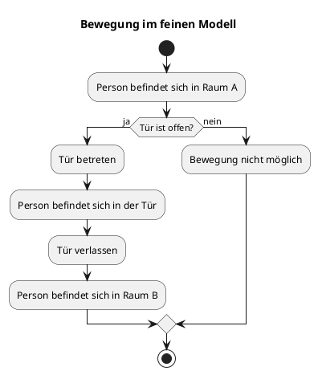
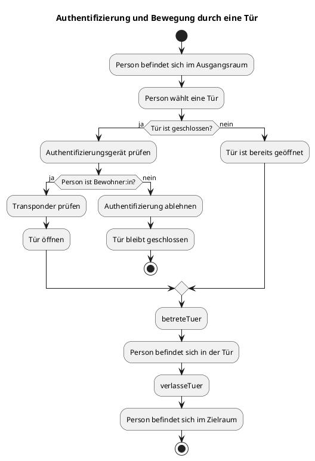
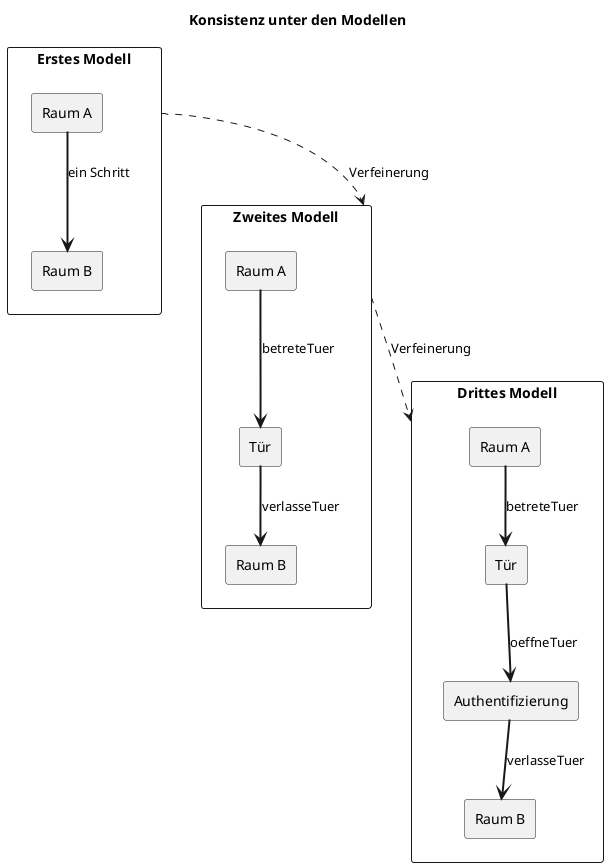

## Einleitung und Ziel der Arbeit

In dieser Arbeit wird ein System modelliert, in dem sich Personen zwischen verschiedenen Räumen bewegen können. Der Zugang zu einzelnen Räumen erfolgt über Türen. Türen können geöffnet oder geschlossen sein und benötigen gegebenenfalls eine Authentifizierung.

Mithilfe von Alloy werden mögliche Systemzustände und Abläufe automatisch untersucht. Lean wird verwendet, um ausgewählte Eigenschaften mathematisch beziehungsweise formal zu beweisen.

## Das Problem

Ein Zugangssystem regelt, welche Personen bestimmte Räume betreten dürfen und unter welchen Bedingungen ein Raumwechsel möglich ist.

In einem Smart-Home-System müssen dabei mehrere Aspekte berücksichtigt werden:

- Wo befindet sich eine Person aktuell?
- Welche Räume und Türen gibt es?
- Welche Räume sind miteinander verbunden?
- Ist eine Tür geöffnet oder geschlossen?
- Darf eine Person die Tür öffnen?
- Was passiert während des Durchgangs durch die Tür?

Um diese Fragen schrittweise zu beschreiben, wird das System in drei Modellschritten betrachtet:

1. **Grobe Bewegung zwischen zwei Räumen**
2. **Detaillierte Bewegung durch eine Tür**
3. **Authentifizierung und Steuerung der Tür**

Als Beispiel werden **Bernd** (welcher seinem Gefängnis entkommen ist und daher nun an der Hochschule RheinMain arbeitet) und sein Gast **Sandmännchen** verwendet:


## Raumplan und räumliche Struktur

Um uns näher an das Modell heranzutasten, schauen wir uns zunächst allgemein einen Raumplan an.

Ein beispielhafter Raumplan könnte für ein öffentliches Gebäude so aussehen (und ist ganz zufällig auch der Ort an dem Bernd und Sandmännchen sich in unserem Beispiel treffen). Die Darstellung hier ist dabei eine vereinfachte Abbildung des Gebäudes. Es werden daher nur die für die Zutrittskontrolle und die Bewegung von Personen relevanten Eigenschaften berücksichtigt. Bauliche Details wie Wandstärken, Treppen, Möbel oder genaue Entfernungen spielen für die formale Spezifikation keine Rolle.


Die im System betrachteten Räume werden in zwei Arten unterteilt: Gärten und Zimmer. Der Garten bildet den Außenbereich und damit den Ausgangspunkt für Personen, die das Gebäude betreten möchten. Zimmer beschreiben die innerhalb des Gebäudes liegenden Bereiche, beispielsweise Flure, Vorlesungsräume oder Büros.

Das Gebäude besteht aus mehreren Bereichen:

- einer Außenanlage beziehungsweise einem Garten,
- allgemein zugänglichen Räumen (beispielsweise den Vorlesungsräumen),
- Büros (weiß, ohne Namen),
- Türen zwischen den einzelnen Bereichen (die offen oder geschlossen sein können).

Die Räume werden über Türen miteinander verbunden. Eine Tür verbindet dabei jeweils zwei benachbarte Bereiche.

## Beispiel: Bernd und sein Gast Sandmännchen

Bernd arbeitet in der Hochschule RheinMain. Das Gebäude D, in welchem er arbeitet, besteht aus einem Garten und mehreren Zimmern. Zwischen den Bereichen befinden sich Türen. Einige der Räume sind für alle betretbar, wie beispielsweise die Flure und die Vorlesungsräume. Andere Räume, wie die Büros, sind aber nur dann betretbar, wenn die Tür authentifiziert werden kann und daher offen ist.

Zu Beginn befinden sich beide Personen im Garten:

- Bernd ist Bewohner des Hauses.
- Sandmännchen ist ein Gast.
- Beide Personen befinden sich im Garten.
- Alle Türen sind geschlossen.
- Sandmännchen besitzt keine dauerhafte Berechtigung, eine Tür zu öffnen.

Der beispielhafte Raumplan von Gebäude D sieht folgendermaßen aus:


Die Bewegungen innerhalb des Gebäudes D von Bernd und Sandmännchen lassen sich nun in unterschiedlichen Detailebenen betrachten.

## Beispiel: Detailebenen des Besuchs

Es gibt nun unterschiedliche Zoom-Ebenen, auf denen wir unterschiedlich viel vom Besuch von Sandmännchen anschauen können. Wir beschreiben daher unser Zugangskontrollsystem als Event-B-Ansatz. Wir unterscheiden zwischen drei Stufen, welche nachfolgend anhand des Besuchs von Sanndmännchen hergeleitet werden.

1. Im ersten Modell bewegen sich Personen direkt von einem Raum in einen anderen. Bernd und Sandmännchen können hier also einfach durch einen Raum zu einem anderen gehen, vorausgesetzt die Tür ist offen.


2. Bei genauerer Betrachtung des ersten Modells fällt auf, dass wir die Tür gerade unbeachtet lassen. Im zweiten Modell durchqueren Personen daher zunächst die Tür und befinden sich für einen Übergangszustand innerhalb der Tür. Bernd und Sandmännchen gehen hier nun also nicht direkt vom Flur in den Vorlesungsraum. Sie verlassen zunächst den Flur, betreten die offene Tür und betreten dann erst den Vorlesungsraum.


3. Türen sind aber in einer Hochschule nicht immer offen. Es muss also ebenfalls einen Mechanismus geben, um in geschlossene Türen zu kommen. Beispielsweise das Büro von Bernd. Will er dieses seinem Gast Sandmännchen zeigen und es ist gerade verschlossen, muss er zunächst mit seinem Transponder das Büro, und damit die Tür, aufschließen. Ist die Tür dann offen, können er und Sandmännchen das Büro betreten. Im dritten Modell besitzen die Türen daher eine Authentifizierung. Ist die Tür geschlossen, lässt sie sich so wieder öffnen. Geschlossene Türen können dabei nur von Personen geöffnet werden, die Bewohner sind und daher einen Transponder haben


## Fachliche Beschreibung des Systems

Aus dem [Gebäudeplan](#raumplan-und-räumliche-struktur) und den [Detailebenen des Besuchs](#beispiel-detailebenen-des-besuchs) ergeben sich nun verschiedene beteiligte Elemente in der Domäne sowie realitätserhaltende Grundregeln. Diese werden nachfolgend erläutert.

### Beteiligte Elemente

Das Zugangskontrollsystem, wie oben beschrieben, hat auf allgemeiner Ebene verschiedene Elemente. Diese sind, ohne Beschreibung ihrer Aufgaben, folgende:

| Element | Bedeutung |
| :--- | :--- |
| Person | Eine Person, die sich im System bewegt |
| Bewohner:in | Eine Person mit dauerhafter Berechtigung für den Zutritt |
| Gast | Eine Person ohne dauerhafte Berechtigung |
| Raum | Ein Bereich, in dem sich Personen aufhalten können |
| Zimmer | Ein Raum, im inneren des Gebäudes |
| Garten | Ein Raum, außerhalb des Gebäudes |
| Tür | Verbindet zwei Räume |
| Authentifizierung | Technische Einrichtung zur Identitäts- oder Berechtigungsprüfung |

### Grundregeln

Darüber hinaus gibt es bestimmte Regeln, die in der Realität immer gelten. Diese sollten daher mit modelliert werden. Die wichtigsten Grundregeln sollten als verständliche Anforderungen formuliert werden:

- Jede Person befindet sich immer genau an einem Ort.
- Eine Tür verbindet genau zwei Räume.
- Eine Tür kann geöffnet oder geschlossen sein.
- Eine Person darf eine Tür nur bei geöffneter Tür passieren.
- Der Bewegungszustand darf keine Teleportation ermöglichen.

Sollten diese Bedinungen verletzt werden, sind wohl weder Bernd noch Sandmännchen sicher und befinden sich in akuter diese-welt-existiert-so-nicht-gefahr. Wir schließen diese daher zur Wahrung eines realitätsnahen Ansatzes aus.

### Abstraktes Datenmodell

Es folgt ein Klassen- und Beziehungsdiagramm für die Grundkomponenten:



**Personen**:
PERSON beschreibt die allgemeine Menge aller Personen. Bewohner:innen und Gäste sind spezielle Arten von Personen. Das Feld `letzterRaum` speichert den letzten Raum, in dem sich eine Person befunden hat.

**Orte**:
Ein Ort kann Personen enthalten und Nachbarn besitzen. Das Feld `nachbarn` beschreibt, welche Orte miteinander verbunden sind.

**Türen und Räume**:
Räume und Türen sind beide Orte. Dadurch können Personen im feinen Modell vorübergehend auch innerhalb einer Tür dargestellt werden. Eine Tür besitzt einen Öffnungszustand und genau ein Authentifizierungsgerät.

### Zeit und Zustandsänderungen

Betrachten wir erneut das Beispiel aus [Detailebenen des Besuchs](#beispiel-detailebenen-des-besuchs). Hier wird deutlich, dass ein einfaches "in einen anderen Raum wechseln", kein atomarer Schritt ist. Vielmehr besteht das in den Raum wechseln (abhängig davon, auf welchem verfeinerungsgrad wir uns das Ganze ansehen) aus einer Reihe an Zustandsänderungen. Um das Modell korrekt modellieren zu können, ist es daher nötig, verschiedene Zustände modellieren zu können. Ein beispielhafter Zustandswechsel für das zweite Modell könnte daher sein:

```text
Zustand 0 (in Raum A) -- Bewegung -->  Zustand 1 (in Tür zwischen Raum A und Raum b) -- Tür passieren --> Zustand 2 (in Raum B)
```

Es muss daher möglich sein das System dahingehend zu modellieren.

**PlantUML-Zustandsdiagramm**



Wir haben daher unser Modell in verschiedene Verfeinerungsstufen eingeteilt. Deren Details und Erklärungen folgen nun.

## Erstes grobes Modell
Das grobe Modell beschreibt Bewegungen auf einer vereinfachten Ebene.

Im groben Modell wird eine Bewegung direkt als Wechsel von einem Raum in einen anderen dargestellt. Die Tür wird dabei nicht als eigener Zwischenaufenthaltsort betrachtet. Es wird lediglich geprüft, ob eine geeignete offene Tür zwischen beiden Räumen existiert.

**Beispiel**

Bernd befindet sich gemeinsam mit Sandmännchen im Flur. Der Vorlesungsraum ist über eine Tür mit dem Flur verbunden. Die Tür ist geöffnet. Bernd möchte nun mit Sandmännchen vom Flur in den Vorlesungsraum gehen. Im groben Modell wird dieser Vorgang als eine einzige Zustandsänderung dargestellt:

```text
Flur  -- Bewegung durch offene Tür -->  Vorlesungsraum
```

Für Bernd und Sandmännchen bedeutet das, dass beide Personen aus dem Flur entfernt und anschließend dem Vorlesungsraum zugeordnet werden. Der Aufenthalt in der Tür wird dabei nicht gesondert modelliert.

Der Wechsel ist nur möglich, wenn folgende Bedingungen erfüllt sind:

- Die Person befindet sich im Ausgangsraum.
- Der Zielraum ist mit dem Ausgangsraum durch eine Tür verbunden.
- Die Tür ist geöffnet.
- Die Bewegung erfolgt zwischen zwei direkt verbundenen Räumen.
- Ist die Tür geschlossen, kann der nächste Raum nicht betreten werden.

**Diagramm**



In diesem Schritt ändern sich daher nur die Aufenthaltsmengen der beiden beteiligten Räume. Andere Räume, Türen und der letzte bekannte Raum einer Person bleiben unverändert.

## Zweites verfeinertes Modell

Das feine Modell stellt den Bewegungsablauf detaillierter dar. Eine Person bewegt sich in zwei Schritten:

1. Die Person betritt eine Tür.
2. Die Person verlässt die Tür und betritt den Zielraum.

**Beispiel**

Bernd und Sandmännchen befinden sich gemeinsam im Flur. Der Vorlesungsraum ist über eine Tür mit dem Flur verbunden. Die Tür ist geöffnet. Im groben Modell wäre die Bewegung ein einzelner Schritt.

Im zweiten Modell wird dieser Vorgang genauer dargestellt:

```text
Flur  ---->  Tür  ---->  Vorlesungsraum
```

Bernd und Sandmännchen verlassen also zunächst den Flur und betreten die geöffnete Tür. Für einen kurzen Übergangszustand befinden sie sich innerhalb der Tür. Anschließend verlassen sie die Tür und betreten den Vorlesungsraum.

**Ablaufdiagramm**



Die Bewegung ist damit in zwei Schritte aufgeteilt worden, nämlich in **betreteTuer** und **verlasseTuer**:

Das Prädikat `betreteTuer` beschreibt den ersten Teil der Bewegung. Die Person muss sich im Ausgangsraum befinden, die Tür muss Nachbar des Raums sein und geöffnet sein. Anschließend wird die Person aus dem Raum entfernt und in die Tür aufgenommen.

Das Prädikat `verlasseTuer` beschreibt den zweiten Teil der Bewegung. Die Person muss sich in der Tür befinden. Der Zielraum muss mit der Tür verbunden sein. Danach wird die Person aus der Tür entfernt und in den Zielraum aufgenommen.

## Drittes feines Modell

Das dritte Modell erweitert das zweite Modell um eine Authentifizierung an der Tür. In den bisherigen Modellen wurde vorausgesetzt, dass eine Tür bereits geöffnet ist. Im dritten Modell kann eine geschlossene Tür zunächst durch eine berechtigte Person geöffnet werden.

Die Bewegung durch die Tür besteht weiterhin aus zwei Schritten:

1. Die Tür wird authentifiziert und geöffnet.
2. Die Person betritt und verlässt die Tür.

Damit wird nun zusätzlich modelliert, wer eine Tür öffnen darf und unter welchen Bedingungen eine Bewegung möglich ist.

**Beispiel**

Bernd befindet sich gemeinsam mit Sandmännchen im Flur. Sie möchten in Bernds Büro gehen. Die Tür zum Büro ist geschlossen. Bernd ist Bewohner der Hochschule und besitzt daher einen Transponder. Sandmännchen ist dagegen nur ein Gast und besitzt keine Berechtigung, eine geschlossene Tür zu öffnen.

Bernd authentifiziert sich an der Tür. Da er Bewohner ist und die Authentifizierung erfolgreich ist, wird die Tür geöffnet. Nun können beide passieren.

**Aktivitätsdiagramm**



Für das Ereignis authentifiziere gelten folgende **Vorbedingungen**:

- Die Person befindet sich in einem Raum neben der Tür.
- Die ausgewählte Tür gehört zu diesem Raum.
- Die Tür ist geschlossen.
- Die Person versucht, sich an der Tür anzumelden.
- Für eine erfolgreiche Authentifizierung muss zusätzlich gelten:
  - Die Person ist Bewohner:in.
  - Die Person besitzt eine gültige Berechtigung.
  - Das Authentifizierungsgerät kann die Berechtigung prüfen.
  - Für die Ereignisse betreteTuer und verlasseTuer gelten weiterhin die Vorbedingungen aus dem zweiten Modell. Insbesondere kann betreteTuer erst dann ausgeführt werden, wenn die Tür geöffnet ist.

Nach einer **erfolgreichen Authentifizierung gelten folgende Nachbedingungen**:

- Die Tür ist geöffnet.
- Die Person bleibt in ihrem bisherigen Raum.
- Die Tür kann anschließend betreten werden.
- Die Berechtigung der Person wird nicht verändert.
- Andere Türen bleiben unverändert.

Schlägt die **Authentifizierung fehl, gelten folgende Nachbedingungen**:

- Die Tür bleibt geschlossen.
- Die Person bleibt im bisherigen Raum.
- Die Person wird nicht in die Tür aufgenommen.
- Andere Türen bleiben unverändert.
- Die Berechtigung der Person wird nicht verändert.

## Konsistenz zwischen den Modellen

Die drei Modell müssen nach Event-B ineinander überführbar sein. Ist etwas also im dritten Modell möglich, muss dieses von außen betrachtet beispielsweise auch im ersten Modell gültig sein. Hiermit kommen weitere Systemgarantien einher, welche genau diese Abwärts-/Aufwärtskompatibilität beschreiben. Das bedeutet, dass wenn eine Person im dritten Modell den Raum wechselt, dies kaskadierend auch für das zweite und erste Modell möglich sein muss. Umgedreht genauso: ist eine Bewegung im ersten Modell möglich, muss diese auch im zweiten und dritten Modell möglich sein.

**Grundidee**

Das grobe Modell überspringt den Aufenthalt in der Tür:

```text
Raum A  -------------------->  Raum B
```

Das feine Modell bildet denselben Vorgang detaillierter ab:

```text
Raum A  ---->  Tür  ---->  Raum B
```

Das verfeinerte dritte Modell widerum bildet noch eine Authentifizierung bei der Tür ab:

```text
Raum A  ---->  Tür (Authentifizierung nötig)  ---->  Raum B
```

**Abbildung**

Jeder zulässige Ablauf im feinen Modell muss daher mit dem groben Modell vereinbar sein. Der zusätzliche Zwischenzustand innerhalb der Tür darf also nicht zu einem anderen fachlichen Ergebnis führen. Die Verfeinerung ist erfolgreich, wenn beide Modelle nach Abschluss einer Bewegung dieselbe Raumzuordnung der Personen liefern.




## Fazit und Ausblick

In dieser Arbeit wurde ein Zugangskontrollsystem modelliert, in dem sich Personen zwischen verschiedenen Räumen bewegen können. Dabei wurden Räume, Türen, Personen, Berechtigungen und Authentifizierungsgeräte berücksichtigt.

Das System wurde schrittweise in drei Modellen beschrieben. Das erste Modell stellt eine Bewegung direkt zwischen zwei Räumen dar. Im zweiten Modell wird der Aufenthalt einer Person innerhalb der Tür als Zwischenzustand ergänzt. Das dritte Modell erweitert den Bewegungsablauf um die Authentifizierung und das Öffnen geschlossener Türen.

Für die Modelle wurden verschiedene Systemgarantien festgelegt. Dazu gehören unter anderem die eindeutige Zuordnung einer Person zu einem Ort, die Verbindung von Türen mit genau zwei Räumen sowie die Bedingung, dass geschlossene Türen nicht ohne Berechtigung passiert werden können. Außerdem wurde beschrieben, welche Zustände sich durch die einzelnen Ereignisse verändern dürfen und welche Systemteile unverändert bleiben müssen.

Die drei Modelle beschreiben denselben fachlichen Vorgang mit unterschiedlich hoher Detailgenauigkeit. Das grobe Modell abstrahiert den Aufenthalt in der Tür. Das zweite Modell macht diesen Zwischenzustand sichtbar. Das dritte Modell ergänzt zusätzlich die Authentifizierung. Nach Abschluss einer Bewegung müssen die Modelle dasselbe fachliche Ergebnis liefern, auch wenn der Ablauf im feineren Modell aus mehreren Einzelschritten besteht.

Als Erweiterungen des Modells wären unter anderem folgende Punkte möglich:

- mehrere Gärten oder Außenbereiche,
- unterschiedliche Berechtigungsstufen,
- mehrere Authentifizierungsgeräte,
- gleichzeitige Bewegungen mehrerer Personen,
- Alarmzustände bei unberechtigtem Zutritt,
- zusätzliche Raumtypen,
- wenn eine Person die Tür über das Authentifizierungsgerät öffnet, könnte durch die offene Tür eine weitere Person den Raum betreten (dazu müssten gleichzeitige Bewegung von Personen möglich sein).

Damit bildet das Modell eine vereinfachte, aber erweiterbare Grundlage für die formale Beschreibung eines Zugangskontrollsystems.