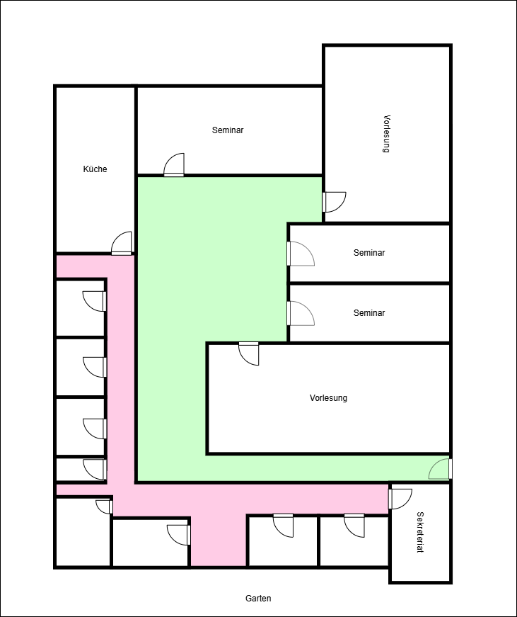
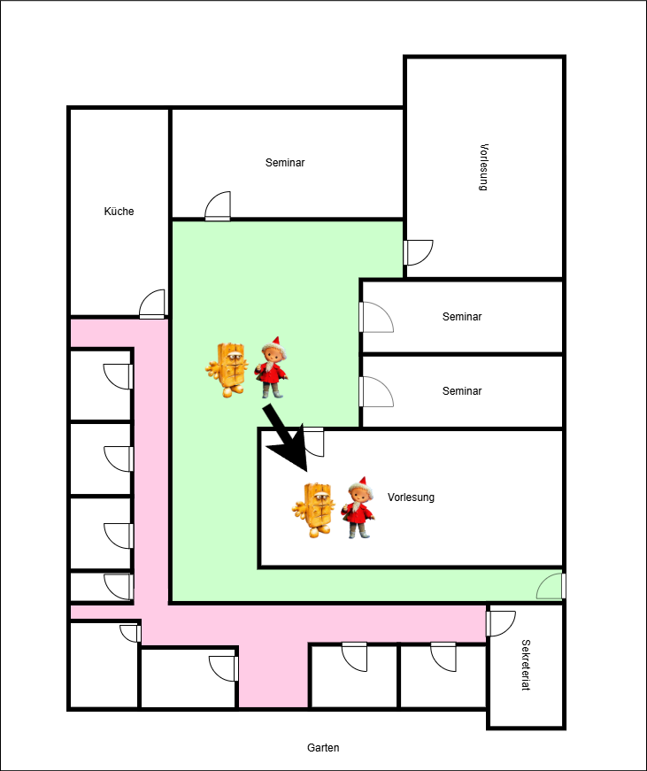
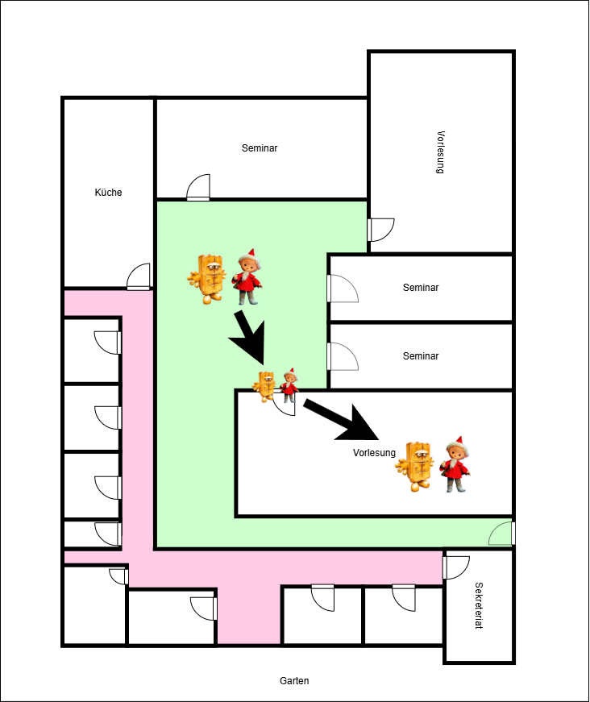
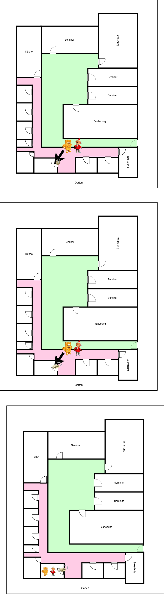
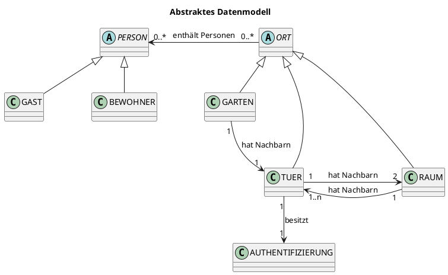
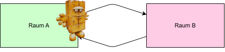
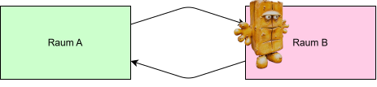
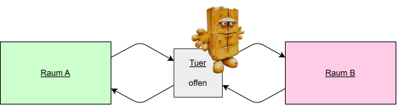
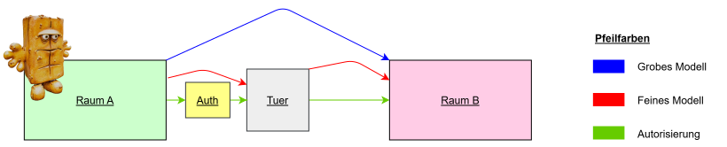
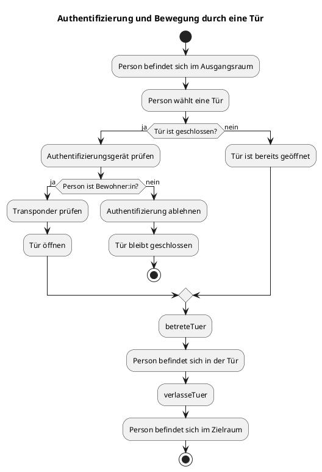

# Einleitung und Ziel der Arbeit

In dieser Arbeit wird ein Zugangskontrollsystem modelliert, in dem sich Personen zwischen verschiedenen Räumen bewegen können. Der Zugang zu einzelnen Räumen erfolgt über geöffnete Türen.

Mithilfe von Alloy werden mögliche Systemzustände und Abläufe über Verfeinerungsschritte untersucht. Lean wird verwendet, um ausgewählte Eigenschaften mathematisch beziehungsweise formal zu beweisen.

# Einführung und Ziel

Ein Zugangskontrollsystem regelt, welche Personen die Türen zu bestimmten Räumen öffnen dürfen, der den Raumwechsel möglich macht.

In einem Smart-Home-System müssen dabei mehrere Aspekte berücksichtigt werden:

- Wo befindet sich eine Person aktuell?
- Welche Räume und Türen gibt es?
- Welche Räume sind miteinander verbunden?
- Ist eine Tür geöffnet oder geschlossen?
- Darf eine Person die Tür öffnen?
- Was passiert während des Durchgangs durch die Tür?

Um diese Fragen schrittweise zu beschreiben, wird das System in drei Modellschritten betrachtet:

1. **Grobe Bewegung zwischen zwei Räumen**
2. **Detaillierte Bewegung durch eine Tür**
3. **Authentifizierung und Steuerung der Tür**

Als Beispiel werden **Bernd** (welcher seinem Gefängnis entkommen ist und daher nun an der Hochschule Rhein-Main arbeitet) und sein Gast **Sandmännchen** verwendet:


## Grundlegende räumliche Struktur

Um die Idee des Projektes zu visualisieren, kann die grundlegende Raumstruktur mithilfe eines Raumplans für das Gebäude D vorgestellt werden, in dem sich Bernd und das Sandmännchen treffen.



Grundlegend können sich Personen in Orten aufhalten. Die im System betrachteten Orte werden in zunächst zwei Arten unterteilt: Gärten und Räume. Der Garten bildet den Außenbereich und damit den Ausgangspunkt für Personen, die das Gebäude betreten möchten. Räume beschreiben die innerhalb des Gebäudes liegenden Bereiche, beispielsweise Flure, Vorlesungsräume oder Büros.

Das Gebäude besteht aus mehreren Bereichen:

- einer Außenanlage beziehungsweise einem Garten,
- allgemein zugänglichen Räumen (beispielsweise den Vorlesungsräumen und Büros),
- Türen zwischen den einzelnen Bereichen (die offen oder geschlossen sein können).

Die Räume werden über Türen miteinander verbunden. Eine Tür verbindet dabei jeweils zwei benachbarte Bereiche. In späteren Verfeinerungsschritten werden auch Türen als Orte betrachtet, in denen sich Personen aufhalten können.

## Beispiel: Bernd zeigt Sandmännchen das D Gebäude

Bernd arbeitet in der Hochschule Rhein-Main. Das Gebäude D, in welchem er arbeitet, besteht aus einem Garten und mehreren Räumen, die er betreten kann, wenn sie durch eine Tür miteinander verbunden sind.

Zu Beginn befinden sich Bernd und Sandmännchen im Garten und folgende Grundannahmen werden getroffen:

- Bernd ist "Bewohner" des Hauses, da er im Gebäude D arbeitet.
- Sandmännchen ist ein Gast.
- Beide Personen befinden sich im Garten.
- Alle Türen sind geschlossen.
- Sandmännchen besitzt keine Berechtigung, eine Tür zu öffnen, da es nur ein Gast ist.

Die Bewegungen innerhalb des Gebäudes D von Bernd und Sandmännchen lassen sich nun in unterschiedlichen Detailebenen betrachten.

## Unterschiedliche Betrachtungsebenen des Besuchs

Für die spätere Modellierung in Alloy ist es nun sinnvoll, mit einer groben Spezifikation der Anforderungen an das System zu beginnen, um in weiteren Verfeinerungsschritten neue Anforderungen zu finden, und diese als jeweils nächsten Verfeinerungsschritt einzubinden. Wir verfolgen mit diesen Spezifikaitonsschritten dem Event-B-Ansatz.

Es gibt nun entsprechend unterschiedliche Betrachtungsebenen, auf denen unterschiedlich viele Informationen vom Besuch von Sandmännchen sichtbar sind. Wir unterscheiden zwischen drei Stufen, welche nachfolgend anhand des Besuchs von Sandmännchen spezifiziert werden. Jede tieferliegende Stufe stellt dabei eine Black-Box für die jeweils darüberliegenden dar.

1. Die Anforderung im groben Modell besteht darin, dass sich Bernd und Sandmännchen zwischen benachbarten Räumen bewegen können. Um den Grundplan für weitere Spezifikationsschritte legen zu können, wurden hier bereits Türen zwischen den Räumen definiert, die beim Betreten des neuen Raums geöffnet sein müssen.



2. Da ein Raumwechsel allerdings durch eine Tür stattfinden soll, und beim Betreten des nächsten Raumes nicht nur eine offene Tür als Voraussetzung gelten soll, sondern auch dass nicht unendlich viele Personen durch die Tür passen, ist es in diesem Verfeinerungsschritt notwendig, dass eine Person in einem Zwischenschritt sich in der Tür befindet. Dort soll immer nur jeweils eine Person hineinpassen. Bernd und Sandmännchen können also nun einzeln durch die Tür gehen, um dann den Vorlesungsraum zu betreten.



3. Türen in der Hochschule sind allerdings nicht immer offen. Es muss also ebenfalls einen Mechanismus geben, um geschlossene Türen öffnen zu können. Möchte Bernd nun sein Büro seinem Gast Sandmännchen zeigen und es ist gerade verschlossen, muss er zunächst mit seinem Transponder das Büro, und damit die Tür, aufschließen. Ist die Tür dann offen, kann er das Büro betreten. Hält Bernd die Tür für das Sandmännchen offen, damit diese nicht zufällt, kann auch das Sandmännchen den Raum betreten. Anschließend kann die Tür aber nach einer beliebigen Zeit wieder zufallen. Geschlossene Türen können dabei nur von Personen geöffnet werden, die in der Hochschule arbeiten und daher einen Transponder haben.



## Fachliche Beschreibung der Objekte

Aus dem [Gebäudeplan](#raumplan-und-räumliche-struktur) und den [Detailebenen des Besuchs](#beispiel-detailebenen-des-besuchs) ergeben sich nun verschiedene beteiligte Elemente in der Domäne sowie realitätserhaltende Grundregeln. Diese werden nachfolgend erläutert.

### Beteiligte Elemente

Das Zugangskontrollsystem, wie oben beschrieben, hat auf allgemeiner Ebene verschiedene Elemente. Diese sind, ohne Beschreibung ihrer Aufgaben, folgende:

| Element | Bedeutung |
| :--- | :--- |
| Person | Eine Person, die sich im den Orten eines Gebäudes bewegt |
| Bewohner:in | Eine Person mit Berechtigung zum Türenöffnen |
| Gast | Eine Person ohne Berechtigung zum Türenöffnen |
| Raum | Ein Ort, in dem sich Personen aufhalten können |
| Garten | Ein Ort, außerhalb des Gebäudes, in dem sich Personen aufhalten können |
| Tür | Verbindet zwei Räume miteinander |
| Authentifizierung | Technische Einrichtung zur Identitäts- oder Berechtigungsprüfung, führt zur Öffnung einer Tür |

### Grundregeln

Darüber hinaus gibt es bestimmte Regeln, die in der Realität immer gelten. Diese sollten daher als Axiome modelliert werden. Diese Grundregeln sollten als verständliche Anforderungen formuliert werden:

- Jede Person befindet sich immer genau an einem Ort.
- Eine Tür verbindet genau zwei Räume.
- Eine Tür kann geöffnet oder geschlossen sein.
- Eine Person darf eine Tür nur bei geöffneter Tür passieren.
- Der Bewegungszustand darf keine Teleportation ermöglichen.

Sollten diese Bedingungen verletzt werden, sind wohl weder Bernd noch Sandmännchen sicher und befinden sich in akuter Diese-Welt-existiert-so-nicht-Gefahr. Wir schließen diese daher zur Wahrung eines realitätsnahen Ansatzes aus.

Über diese grundlegenden Gesetze hinaus, gibt es noch weitere definierte Axiome, die die Umsetzung des D Gebäude möglich machen:

- alle Räume sind von allen Räumen aus erreichbar und befinden sich entsprechend im gleichen Gebäude
- es gibt um das Gebäude herum einen einzigen Garten als Außenbereich
- der Garten des Gebäudes kann nur durch eine Eingangs-/Außgangstür betreten bzw. verlassen werden
- jeder Nachbarraum eines Raums ist wiederum Nachbar des Nachbarraums

### Abstraktes Datenmodell

Es folgt ein Klassen- und Beziehungsdiagramm für die Grundkomponenten:



**Personen**:
PERSON beschreibt die allgemeine Menge aller Personen. Bewohner:innen und Gäste sind spezielle Arten von Personen.

**Orte**:
Ein Ort kann Personen enthalten und Nachbarn besitzen. Das Feld `hat Nachbarn` beschreibt, welche Orte miteinander verbunden sind. Dabei haben Türen immer Räume als Nachbarn und Türen immer Räume als Nachbarn. Die Beziehungen zu den Nachbarn sind immer symmetrisch.

**Türen und Räume**:
Räume und Türen sind beide Orte. Dadurch können Personen im feinen Modell vorübergehend auch innerhalb einer Tür dargestellt werden. Eine Tür besitzt einen Öffnungszustand und genau ein Authentifizierungsgerät.

# Modellspezifikation

Die fachlichen Anforderungen sind in der [Modellspezifikation](./MODEL_SPEZIFIKATION.md) beschrieben. Im Folgenden wird erklärt, wie diese Anforderungen in Alloy und Lean als Modell umgesetzt und bewiesen wurden.

# Modellierung in Alloy

Die Umsetzung des Modells in Alloy basiert auf den Anforderungen der Spezifikation. Dabei sind die Spezifikationsschritte auf Basis der Umsetzung des vorherigen Schritts verfeinert worden.

Zunächst wurden die grundlegenden Objekte und deren Beziehungen über Signaturen in Alloy modelliert (siehe [Grundregeln](#Grundregeln)). 

Bereits aufgelistete Axiome wurden dabei in Alloy als facts definiert, damit diese bei jedem Durchlauf des Modells greifen. Dazu gehören Eigenschaften wie:

- Jede Person befindet sich immer genau an einem Ort.
- Eine Tür verbindet genau zwei Räume.
- Eine Tür kann geöffnet oder geschlossen sein.
- Eine Person darf eine Tür nur bei geöffneter Tür passieren.

Ebenfalls als facts wurden die Strukturen definiert, die die Struktur des Gebäudes ausmachen:

- alle Räume sind von allen Räumen aus erreichbar und befinden sich entsprechend im gleichen Gebäude
- es gibt um das Gebäude herum einen einzigen Garten als Außenbereich
- jeder Nachbarraum eines Raums ist wiederum Nachbar des Nachbarraums

## Event-B

Es folgt eine Erklärung zur Defintion der Event-B Modelle.

### Umsetzung des Groben Modells

Um erste Bewegungsabläufe von Personen zwischen Räumen modellieren zu können haben wir zunächst Personen und unterschiedliche Orte als Räume und Gärten definiert. Eine Person kann sich in einem Ort aufhalten.



Personen können nun zwischen benachbarten Räumen wechseln. Dafür enthält jeder Raum eine Liste aus Nachbarräumen. Wichtig ist, dass Nachbarräume symmetrisch sind, weshalb wir dies als fact in Alloy für unsere Raumstruktur festgelegt haben (siehe Alloymodell: fact alleNachbarnSindSymmerisch).

Die Bewegung wurde definiert als das Entfernen der Person aus Raum A und das Hinzufügen dieser in den benachbarten Raum B (siehe Alloymodell: pred move).



In diesem Schritt ändern sich daher nur die Personen der beiden beteiligten Räume. Für alle anderen Räume wird durch eine Frame-Condition definiert, dass sich die Personen in diesen Räumen nicht ändern.

### Umsetzung des Feinen Modells

Im feinen Modell wurden nun Türen zwischen den Räumen modelliert, durch die die Personen gehen müssen, um in einen benachbarten Raum zu wechseln. Der Wechsel in den benachbarten Raum teilt sich nun in zwei Zwischenschritte auf: 

1. Die Person betritt die Tür
2. Die Person verlässt die Tür



Eine eingeführte Voraussetzung ist, dass die Tür, durch die eine Person gehen möchte, geöffnet sein muss. Dies haben wir als pre-Bedingung festgehalten (siehe Alloymodell: pred betreteTuer).

Da an dieser Stelle für einen einzelnen Schritt im groben Modell zwei Schritte im feinen Modell notwendig sind. Ist die Einführung eines ersten Stutter-Vorgangs im groben Modell wichtig.

Ziel ist, dass das Ergebnis des feinen Modells auch im Ergebnis des groben Modells vorhanden sein soll. Zwischenschritte des feinen Modells sind entsprechend als Blackbox im groben Modell zu betrachten.

|  | Schritt 1 | Schritt 2 |
|----------|----------|----------|
| Grob   | Stutter   | betreteRaum   |
| Fein   | betreteTuer   | verlasseTuer   |

In diesem Stutter-Vorgang ist festgelegt, dass sich die Person im groben Modell nicht bewegt. Dies wurde mit einer Frame-Condition ermöglicht, die definiert, dass sämtliche Personen in dem Modell in ihrem aktuellen Raum bleiben.

Ziel war es, wenn sich eine Person im feinen Modell in Raum A, befindet, dass dies auch für das grobe Modell gilt.

Wenn die Person allerdings die Tür verlässt und Raum B betritt, soll das für das grobe Modell ebenfalls gelten.

Wenn die Person im feinen Modell in der Tür steht, ist das aus Sicht des groben Modells betrachtet, eine Blackbox:


### Umsetzung der Authentifizierung

Im zweiten Verfeinerungsschritt, wurde nun die Voraussetzung eingeführt, dass Bewohner sich authentifizieren müssen, um eine Tür zwischen benachbarten Räumen öffnen zu können. Wenn die Tür geöffnet wurde, besteht für Personen wieder die Möglichkeit eines Raumwechsels.

Da sich nur Bewohner Authentifizieren können, ist es nun notwendig, Personen in Bewohner und Gäste aufzuteilen. Das Bewegen zwischen Räumen mit einer verschlossenen Tür wird für Gäste also erst möglich, wenn ein Bewohner die Tür vorher aufgeschlossen hat.

Für eine bessere Visualisierung wurde in nachfolgenden Grafiken ein Authentifizierungsobjekt eingeführt, dieses ist in Alloy allerdings nicht explizit vorhanden, die Autorisierung findet hier direkt über die Tür statt. 


### Synchronisierung der Modellebenen

Da das grobe Modell als Blackbox für die verfeinerten Schritte betrachtet werden kann, allerdings die Ergebnisse der feineren Modelle sich im groben Modell widerspiegeln müssen, ist es nun notwendig, die Abläufe der Verfeinerungsgrade zu synchronisieren. Dabei wird für jede neu hinzugefügten Verfeinerungsschritt ein Stutter-Vorgang im darunterliegenden Modell eingeführt.

Betrachtet man beispielsweise den ersten Schritt der Autorisierung, darf Alloy in keinem der Modelle Änderungen der Invarianten vornehmen, ausgenommen, dass sich die Verbindungstür der Nachbarräume öffnet. Im Stutter des ersten Schritts auf allen Modell-Ebenen dürfen entsprechend die Personen des Groben und feinen Modells, die Variable des letzten Raumes der Personen und die restlichen Türen nicht verändert werden (siehe Alloymodell: StutterSchritt_1).

Insgesamt ergibt sich folgende Tabelle der Modell-Vorgänge:

|  | Schritt 1 | Schritt 2 | Schritt 3 |
|----------|----------|----------|----------|
| Grob   | Stutter   | Stutter   | betreteRaum |
| Fein   | Stutter   | betreteTuer   | verlasseTuer |
| Auth   | Tuer oeffnen   | betreteTuer   | verlasseTuer |
| Stutter| Stutter_1    | Stutter_2    |      |

Gleiche Modell-Vorgänge grafisch visualisiert:



Da das Modell immer nur Schritte einzelner Personen ausführt und auch beim Türenöffnen immer nur ein Objekt explizit angesprochen wird, ist es nun notwendig, Alloy durch Frame Contitions daran zu hindern, weitere, nicht explizit definierte Schritte im Modell auszuführen. Das wird in den einzelnen Zustandsübergängen durch Frame-Conditions ermöglicht, die die Änderung restlicher gleicher Objekte untersagt (siehe Alloy-Modell: betreteTuer, verlasseTuer). Dabei reichen die Frame-Conditions in den feineren Ebenen aus, da diese auch automatisch für das Grobe modell gelten.

## Zusammengefasste Ablaufschritte der zweiten Verfeinerung

**Aktivitätsdiagramm**



# Beweisen mit Lean

Lean wird für mathematische Beweise verwendet. Wir haben dabei im ersten Schritt zuerst Alloy spezifiziert (siehe [Alloy](#modellierung-in-alloy)) und dann aus den dort spezifizierten Objekten und Bedingungen (pre-/post-/frame-Bedingungen) Lean abgeleitet. Um die Spezifizierung hier genauer Beschreiben zu können, wird sie folgend in die Umsetzung der Objekte und der Beweise unterteilt.

Besonders herausfordernd war hierbei, dass wir komplexe Objekte für unsere Event-B-Beweise nutzen mussten und bisher wenig Erfahrung beim Beweisen mit komplexen Objekten hatten.

## Abbildung der Objekte aus Alloy nach Lean

Durch Alloy war bereits das Konstrukt der Objekte vorgegeben. Dieses wollten wir so ähnlich wie möglich übernehmen. Problematisch war dabei, dass in Lean keine `var` Variablen (mit zeitlichen Veränderungsmöglichkeiten) modelliert werden können. Ebenso ist es in Lean nicht möglich mit "einfachen" Datentypen einen Graphen zu erstellen, welchen wir für die Modellierung der Räume/des Gebäudes benötigt haben.

Wir haben uns daher entschieden bei unseren Objekten in zwei Kategorien zu unterscheiden:
- Objekte, die eine statische Struktur wiederspiegeln
- und Objekte, die zeitabhängig sind und ihren Inhalt verändern können.

Teil der statischen Struktur sind damit alle Räume und Türen, da diese ihren Standort nicht ändern. Teil der zeitabhängigen Inhalte sind alle Objekte, deren Inhalte sich verändern, z.b. die Belegung der Räume, der letzte Raum der Personen und ob eine Tür gerade offen oder geschlossen ist.

### Umsetzung der statischen Struktur

Die statische Struktur haben wir über das Lean-Interface SimpleGraph umgesetzt. Ein SimpleGraph bringt Nachbarschaftssymmetrie und Schleifenfreiheit bereits als Bestandteil seiner Definition mit. Beides mussten wir dadurch nicht selbst als Eigenschaft unseres Gebäudeplans nachweisen, sondern haben es "geschenkt" bekommen, sobald wir unseren GebaeudePlan als SimpleGraph (OrtSet Orte) definiert haben. Ebenso kommen mit SimpleGraph bereits zu beweisene Sätze einher, welche wir für die Beweise einsetzen konnten.

Für unser Modell reicht ein beliebiger SimpleGraph allerdings nicht aus, da er auch Kanten zwischen zwei Räumen oder zwei Türen zulassen würde. Fachlich soll ein Raumwechsel aber immer über eine Tür erfolgen, und eine Tür soll immer genau zwei Räume verbinden, niemals eine andere Tür. Wir haben diese Einschränkung daher als eigene Eigenschaft _KanteIsBipartite_ formuliert, die für jede Kante verlangt, dass sie einen Raum mit einer Tür verbindet, und bündeln sie zusammen mit weiteren Grundeigenschaften in der Struktur _BipartiteOrtGraph_, die auf _GebaeudePlan_ aufbaut. Damit ist ein Gebäudeplan im Sinne unseres Modells nicht irgendein Graph, sondern ein Graph, der die fachliche Bedingung "Raum–Tür–Raum" erfüllt.

Auch die weiteren Eigenschaften von _BipartiteOrtGraph_, etwa dass es genau einen Garten gibt und dieser genau eine angrenzende Tür besitzt, haben wir nicht als freistehende axiom-Deklarationen formuliert, sondern als Felder der Struktur, die bei der Konstruktion eines konkreten Gebäudeplans tatsächlich erfüllt und damit bewiesen werden müssen. Ein axiom hätte Lean lediglich angewiesen, die jeweilige Aussage ungeprüft zu übernehmen. Uns war dagegen wichtig zu zeigen, dass unsere Definitionen nicht ins Leere laufen, sondern dass sich mit ihnen tatsächlich ein Gebäudeplan konstruieren lässt, der alle geforderten Eigenschaften erfüllt. Das zeigen wir an unserem Beispielgebäude (siehe [Beispiel.lean](/LeanProjekt/LeanProjekt/Beispiel.lean)), für das wir _BipartiteOrtGraph_ explizit instanziieren und dabei jede der geforderten Eigenschaften beweisen.

Für die wiederkehrenden Datentypen _OrtSet_, _TuerSet_, _RaumSet_ und _PersonSet_ haben wir jeweils Abkürzungen definiert, die ein Element zusammen mit dem Nachweis bündeln, dass es tatsächlich zur betrachteten Gebäudekonfiguration _orte_ beziehungsweise Personenmenge _personen_ gehört. Dadurch legt Lean an vielen Stellen bereits automatisch fest, mit welchen konkreten Objekten wir arbeiten dürfen, ohne dass wir die Zugehörigkeit jedes Mal von Hand mitführen müssten.

Durch diese Definitionen ergeben sich bereits mehrere Eigenschaften implizit, ohne dass wir sie gesondert beweisen mussten:

- Der Öffnungszustand einer Tür besitzt immer genau einen Wahrheitswert, da `offen : OrtSet orte → Bool` bereits als totale Funktion nach `Bool` definiert ist.
- Der letzte Raum einer Person ist entweder ein Raum oder nicht gesetzt, da `letzterRaum : Person → Option Raum` bereits genau diese beiden Fälle abbildet.
- Jede Person ist entweder Bewohner:in oder Gast, da dies durch den induktiven Datentyp `Person` mit seinen beiden Konstruktoren bereits erschöpfend festgelegt ist.
- Räume und Türen sind stets unterscheidbare Orte, da `Ort.Raum` und `Ort.Tuer` getrennte Konstruktoren desselben induktiven Typs `Ort` sind.
- Nachbarschaftssymmetrie und Schleifenfreiheit sind, wie oben beschrieben, bereits Bestandteil von `SimpleGraph`.

Diese Eigenschaften mussten wir also nicht zusätzlich als eigene Sätze formulieren und beweisen, sondern sie folgen bereits aus der Art, wie wir die zugrunde liegenden Typen konstruiert haben. Das ist einer der Vorteile, ein Modell möglichst direkt über die Typstruktur statt über nachträgliche Zusatzbedingungen abzubilden: Ein falsch konstruiertes Objekt lässt sich in diesen Fällen in Lean gar nicht erst hinschreiben.

### Umsetzung der veränderlichen Struktur (Zuständen) 

Für die veränderlichen Anteile des Modells hätten wir prinzipiell auch ohne einen eigenen Zustand-Typ arbeiten können, indem wir Belegung, Öffnungszustand und letzten Raum als lose nebeneinanderstehende Listen beziehungsweise Funktionen durch die Beweise reichen. Wir haben uns stattdessen für eine gemeinsame Struktur _Zustand_ entschieden, da sich damit an einer Stelle festlegen lässt, welche Grundeigenschaften ein Zustand immer erfüllen muss. Ein Zustand lässt sich in Lean gar nicht erst anlegen, wenn diese Eigenschaften nicht erfüllt sind, denn sie sind Teil der Struktur selbst und nicht nur nachträglich behauptete Aussagen über sie.

Dadurch verschiebt sich die eigentliche Beweislast von der Konstruktion in die Veränderung: Statt bei jeder Verwendung eines Zustands erneut zeigen zu müssen, dass er sinnvoll ist, muss nur noch bei jedem Übergang gezeigt werden, dass der neue Zustand die Invarianten weiterhin erfüllt. Diese Invarianten haben wir bewusst nicht als freistehende axiom-Deklarationen formuliert, sondern als Felder der Struktur beziehungsweise als zu beweisende Eigenschaften über unserem Beispielgebäude (siehe Beispiel.lean). Ein axiom würde Lean lediglich mitteilen, die Aussage ungeprüft zu akzeptieren, für uns war hingegen wichtig, tatsächlich zu zeigen, dass sich mit unseren Definitionen überhaupt ein Zustand konstruieren lässt, der allen Anforderungen genügt, und nicht nur, dass wir uns die entsprechende Eigenschaft wünschen.

Für die häufig wiederkehrenden Datentypen _OrtSet_, _TuerSet_, _RaumSet_ und _PersonSet_ haben wir jeweils Abkürzungen definiert, die einen Ort beziehungsweise eine Person zusammen mit dem Nachweis bündeln, dass dieses Element tatsächlich zur jeweils betrachteten Gebäudekonfiguration orte beziehungsweise Personenmenge personen gehört. Dadurch legt Lean die zulässigen Typen an vielen Stellen automatisch fest, ohne dass wir die Zugehörigkeit jedes Mal erneut von Hand mitführen müssen. <!-- Sprachlich ähnlich zu dem Teil der Definitionen oben -->

Ein Grundproblem bei der Modellierung veränderlicher Daten in Lean ist, dass es keine Variablen im klassischen Sinn gibt: Ein Wert lässt sich nicht "an Ort und Stelle" verändern, jede Änderung erzeugt formal ein neues, unabhängiges Objekt. Hätten wir die Belegung eines Ortes direkt als Bestandteil des Gebäudegraphen modelliert, etwa als Eigenschaft der Knoten selbst, so hätte jede Bewegung einer einzigen Person einen vollständig neuen Graphen erzeugt, dessen statische Eigenschaften wir jedes Mal erneut hätten nachweisen müssen. Aus diesem Grund trennen wir strikt zwischen der statischen Struktur (dem _GebaeudePlan_ beziehungsweise _BipartiteOrtGraph_, der über die gesamte Modellierung hinweg unverändert bleibt) und den veränderlichen Inhalten (_Belegung_safe_, _offen_, _letzterRaum_), die wir als eigene, vom Graphen unabhängige Abbildungen in Zustand führen. Eine Bewegung verändert damit ausschließlich diese Abbildungen und erzeugt einen neuen Zustand. Der zugrunde liegende Gebäudeplan bleibt über alle Schritte hinweg derselbe Wert und muss nicht erneut bewiesen werden.

Der Öffnungszustand einer Tür wird in unserem Modell nur explizit durch das Ereignis _oeffneTuer_ verändert, und zwar ausschließlich vom geschlossenen in den geöffneten Zustand. Das entspricht der fachlichen Anforderung aus der Spezifikation, dass eine Authentifizierung niemals Türen schließt, sondern nur öffnet. Das eigenständige Zufallen einer geöffneten Tür nach einer beliebigen Zeit haben wir hingegen nicht als eigenes Lean-Ereignis modelliert, sondern bewusst offengelassen: Die Spezifikation macht dazu selbst keine Aussage darüber, wann genau dies geschieht, sondern nur, dass es irgendwann geschieht. Ein solches "irgendwann" ist eine Lebendigkeits- und keine Sicherheitseigenschaft und hätte andere Beweistechniken erfordert als die von uns betrachteten pre-/post-/frame-Bedingungen einzelner Schritte.
<!-- "Lebendigkeits... -->

## Beweise

Nach der Definition der Objekte mit ihren Eigenschaften konnten wir dann Beweise schreiben. Die Beweise orientieren sich an den Definitionen von Alloy mit den pre-/post- und frame-Bedingungen.

Es gibt dabei zwei Abstaktionsebenen:
1. Beweise direkt über die Listen
2. Beweise über den Zustand, verbindend aller pre-/post-Bedingungen

In Lean werden daher insbesondere folgende Eigenschaften betrachtet:

- Die Frame-Bedingungen und Grundannahmen bleiben nach einer Bewegung erhalten.
- Pre- und Post-Bedingungen umschließen eine Aktion.
- Eine ausgeführte Aktion führt nicht zu inkonsistenten Zuständen.

Diese Eigenschaften wurden dann über die zwei Abstraktionsebenen sichergestellt. Es gibt dabei immer eine Aktionsmethode, welche die eigentliche Aktion ausführen (bspw. das Entfernen einer Person A aus einem Raum X). Um diese Aktion herum sind dann die pre-/post- und frame-Bedingungen geschachtelt

### Definition von Übergängen

Jeder Übergang ist nach demselben Schema aufgebaut: Eine Vorbedingung (`pre_...`) beschreibt, welche Voraussetzungen vor dem Schritt gelten müssen, eine Aktionsfunktion (`aktion_...`) berechnet die eigentliche Änderung, und eine Nachbedingung (`post_...`) beschreibt den resultierenden Zustand. Frame-Bedingungen (`frame_...`) legen fest, welche Anteile des Zustands von einem Schritt unberührt bleiben. Diese vier Bestandteile fassen wir jeweils in einer gemeinsamen `...Schritt`-Relation zusammen (zum Beispiel `moveGrobSchrittZustand`, `betreteTuerSchritt`, `verlasseTuerSchritt`, `oeffneTuerSchritt`), sodass ein einzelner Übergang zwischen zwei Zuständen `Z` und `Z'` immer über genau eine solche Relation beschrieben wird. Das entspricht in Aufbau und Zweck den `pred`-Definitionen in Alloy und stellt sicher, dass alle im Modell zugelassenen Änderungen an einer Stelle gebündelt sind, statt über verstreute Einzelaussagen nachgewiesen werden zu müssen.

### Formulierung der Invarianten und Axiome

Warum wir Grundeigenschaften grundsätzlich nicht als axiom, sondern als zu beweisende Felder formulieren, wurde bereits in den vorherigen Abschnitten begründet. Ergänzend dazu ist an dieser Stelle wichtig, wie die einzelnen Grundregeln aus der Spezifikation in Lean formuliert sind: Wir haben jede Regel als eigenständige, benannte Prop-Definition festgehalten (etwa `einePersonGenauEinOrt`, `tuerOffenWennPerson`, `relation_verfeinerung` oder `nurBekanntePersonen`), statt sie direkt und unbenannt in _BipartiteOrtGraph_ beziehungsweise _Zustand_ hineinzuschreiben. Dadurch lässt sich jede Regel einzeln referenzieren, unabhängig von der Struktur formulieren und in mehreren Beweisen wiederverwenden. Die Felder von _BipartiteOrtGraph_ und _Zustand_ binden diese Definitionen dann lediglich ein, anstatt die Bedingungen selbst zu enthalten. Das entspricht in der Struktur den benannten fact-Blöcken in Alloy und macht zugleich sichtbar, welche fachliche Regel aus der Spezifikation hinter welcher Invariante steht.

### Zwei Abstraktionsebenen der Beweise

Viele der Eigenschaften, die einen Bewegungsschritt betreffen, beweisen wir auf zwei unterschiedlichen Ebenen: einmal direkt über die Belegung (_Belegung_safe_), einmal über den vollständigen Zustand. Das ist keine unnötige Verdopplung, sondern eine bewusste Schichtung.

Auf der Belegungsebene zeigen wir Eigenschaften wie zum Beispiel, dass eine Person nach einer groben Bewegung nicht mehr im Ausgangsraum steht:

```lean
theorem moveGrob_person_nicht_in_von {orte : Finset Ort} (G : BipartiteOrtGraph orte) (offen : TuerSet orte → Bool) (p : Person) (von nach : RaumSet orte) (b : Belegung_safe orte)  :
    pre_moveGrobMitTuer G offen p von nach b → p ∉ personenImOrt (verschiebePerson p (raumAlsOrt von) (raumAlsOrt nach) b) (raumAlsOrt von) := by
```

Ein solcher Beweis betrachtet ausschließlich die Belegung: Die Person war vorher im Ausgangsraum, Ausgangs- und Zielraum sind verschieden, und nach der Aktion ist die Person dort nicht mehr enthalten. Weder der übrige Zustand noch `offen`, `letzterRaum` oder die restlichen Invarianten spielen dabei eine Rolle. Dadurch bleibt der Beweis einfach, unabhängig vom restlichen Modell wiederverwendbar und leicht auf ähnliche Aktionen übertragbar.

Auf der Zustandsebene übertragen wir diese Eigenschaft dann auf einen vollständigen Übergang zwischen zwei Zuständen:

```lean
theorem moveGrobSchrittZustand_person_nicht_in_von {orte : Finset Ort} {personen : Finset Person} (G : BipartiteOrtGraph orte) (p : Person) (von nach : RaumSet orte) (Z Z' : Zustand orte personen) : 
    moveGrobSchrittZustand G p von nach Z Z' → p ∉ personenImOrt Z'.belegungGrob (raumAlsOrt von) := by
```

Die beiden Ebenen beantworten unterschiedliche Fragen: Die Belegungsebene beschreibt, was eine Aktion mit einer Belegung macht, unabhängig davon, wie diese Belegung eingebettet ist. Die Zustandsebene beschreibt, wie sich diese Änderung in einen vollständigen, invariantenerhaltenden Systemschritt einfügt, und ist dafür notwendig, sobald Aussagen über offene Türen, den letzten Raum oder das Zusammenspiel von grober und feiner Belegung getroffen werden sollen. Eine reine Belegungsaussage würde für solche Fragen nicht ausreichen und eine reine Zustandsaussage würde umgekehrt für einfache Aussagen wie die obige unnötig viele, für die eigentliche Aussage irrelevante Zustandsfelder mitschleppen. Wir haben uns daher durchgehend dafür entschieden, zunächst die grundlegende Eigenschaft auf der jeweils einfachsten Ebene zu zeigen und sie anschließend in den vollständigen Zustandsübergang zu heben.

### Umgesetzte Beweise

Die in Lean umgesetzten Beweise umfassen:

**Statische Struktur**
- Räume und Türen sind disjunkt.
- Nur Raum–Tür-Kanten sind erlaubt.
- Nachbarschaft ist symmetrisch.
- Graph ist schleifenfrei.
- Genau ein Garten existiert.
- Der Garten hat genau eine Tür.
- Jede Tür verbindet genau zwei Räume.

**Zustand**
- Jede betrachtete Person befindet sich im groben Modell genau einmal.
- Jede betrachtete Person befindet sich im feinen Modell genau einmal.
- Keine Person befindet sich grob in einer Tür.
- Nur bekannte Personen kommen in den Belegungen vor.
- Eine belegte feine Tür ist offen.
- Die feine Belegung verfeinert die grobe Belegung.
- Die Verfeinerungsrelation bleibt erhalten.

**Grobe Bewegung**
- Person verlässt den Ausgangsraum.
- Person kommt im Zielraum an.
- Andere Personen bleiben unverändert. 
- Die Personen im von Raum bleiben unverändert bis auf p. 
- Nach Bewegung enthält Zielort vorherige Personen + p.
- Türen und Graph bleiben unverändert.
- Es gibt eine offene Tür die die zwei Räume miteinander verbindet.
- Keine grobe Bewegung in/über eine Tür.
- Der Öffnungsstatus der Tür zwischen den zwei Räumen verändert sich nicht.
- Keine grobe Bewegung in eine Tür. -> durch Typen sichergestellt

**Feine Bewegung**
- Person kann eine offene Tür betreten.
- Person befindet sich danach in der Tür.
- Grobes Modell bleibt beim Betreten unverändert.
- Person kann die Tür in den Zielraum verlassen.
- Person befindet sich danach im Zielraum.
- Der grobe Schritt stimmt mit dem Ergebnis des feinen Schritts überein.
- Andere Personen bleiben unverändert.
- letzterRaum wird korrekt aktualisiert. -> erst nach verlasseTuer ist der letzteRaum neu gesetzt worden, nicht schon bei betreteTuer
- Die Verfeinerungsrelation bleibt nach Aktionen erhalten.

**Türöffnung**
- Nur Bewohner:innen dürfen Türen öffnen.
- Die Person muss an die Tür angrenzen.
- Eine geschlossene Tür wird geöffnet.
- Andere Öffnungszustände bleiben unverändert.
- Belegungen bleiben unverändert.

# Transparenz über KI-Nutzung

An dieser Stelle möchten wir transparent über unseren Einsatz von KI-Werkzeugen aufklären. Insbesondere für den Lean-Teil der Arbeit haben wir KI-Unterstützung genutzt. Das hatte zwei Gründe: Zum einen war uns die Objekt-Syntax und der allgemeine Umgang mit Objekten in Beweisen in Lean zu Beginn nicht vertraut, zum anderen war der Umfang des Event-B-Ansatzes groß und dementsprechend schwer auf Objekt-Syntax anwendbar.

Gerade zu Anfang waren wir uns bei der korrekten Objektstruktur (SimpleGraph und Zustand als zentrale Objekte) sowie beim eigentlichen Beweisvorgehen mit Event-B in Lean noch sehr unsicher. Da uns insbesondere nicht klar war, wie sich Invarianten und Axiome sinnvoll im Zusammenspiel mit unseren Objekten formulieren lassen, fiel uns der Einstieg zunächst schwer. Hier haben wir für die Evaluation von Möglichkeiten, deren Bewertung und der Entwicklung erster Ansätze daher auf KI-Werkzeuge zugegriffen.

Für die Ausarbeitung haben wir dabei vor allem die [Hochschul-KI](https://ki.hs-rm.de) genutzt. Sollten in unserer Arbeit daher Lean-Formulierungen auftauchen, die unüblich oder nicht idiomatisch gewöhnlich sind, liegt das an unserem zu diesem Zeitpunkt noch begrenzten eigenen Wissen und nicht an mangelnder Sorgfalt.

# Ausblick und Fazit

In dieser Arbeit wurde ein Zugangskontrollsystem modelliert, in dem sich Personen zwischen verschiedenen Räumen bewegen können. Dabei wurden Räume, Türen, Personen, Berechtigungen und Authentifizierungsgeräte berücksichtigt.

Das System wurde insgesamt schrittweise in drei Modellen beschrieben, die jeweils aufeinander aufbauen. Aufbauend auf den Modellierungen, wie sie in Alloy vorliegen, konnten in Lean entsprechende Modelle und Vorgänge nachgebaut und bewiesen werden.

Das System wurde schrittweise in drei Modellen beschrieben. Mit dem Groben Modell haben wir den gewünschten Anfangs- und Endzustand modelliert. Die Ergebnisse der verfeinerten Modelle sollten denen des Groben Modells gleich sein.

In einem verfeinerten Schritt haben wir die Zwischenschritte in den Türen hinzugefügt. Diese bilden die Grundlage für die Authentifizierung, da Personen ohne Berechtigung in einem weiteren Schritt Türen nicht passieren dürfen. 

In dem Schritt der Authentifizierung wurde nun eine erste Bedingung hinzugefügt, dass Personen Bewohner sein müssen, damit sie Türen öffnen können. Diese Verfeinerung könnte einerseits durch weitere Bedingungen ausgebaut werden.

Wenn man das System wiederum nach Event-B ausarbeiten möchte, könnte man den jetzigen Authentifizierungsschritt wiederum als Blackbox betrachten und in der Hinsicht das System um weitere Logik durch das Hinzufügen von Verfeinerungsschritten ergänzen:

So könnte beispielsweise die Authentifizierung nicht nur überprüfen, ob es sich bei der Person um einen Bewohner handelt, sondern auch, dass eine maximale Kapazität des Raumes eingehalten wird. Es könnten aber auch andere Abhängigkeiten modelliert werden, beispielsweise dass Räume nur zu bestimmten Uhrzeiten betreten werden dürfen. Da es gerade bei der Authentifizierung sehr viele Möglichkeiten gibt, Raumzugänge zu regeln, wäre hier eine breite Komplexität in diesem Verfeinerungsschritt möglich. Dabei könnte eine Struktur zur Hinterlegung dieser Regeln entwickelt werden, beispielsweise könnte jeder Raum, je nach Raumtyp, eigene Regeln besitzen, die von einem Authentifizierungsgerät ausgelesen und auf jeweilige externe Gegebenheiten, beispielsweise Personentypen, Wetterbedingungen oder Uhrzeiten, angewendet werden können. Auch könnten mögliche parallele Authentifizierungen von Personen in gleichen Räumen modelliert werden und eventuelle Regelverletzungen der Authentifizierung in solchen Situationen erkannt, und entsprechende Spezifikationslücken geschlossen werden.

Insgesamt bildet das Modell eine vereinfachte, aber erweiterbare Grundlage für die formale Beschreibung eines Zugangskontrollsystems.