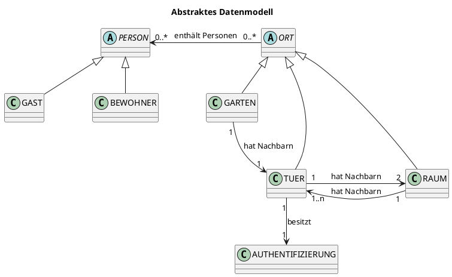
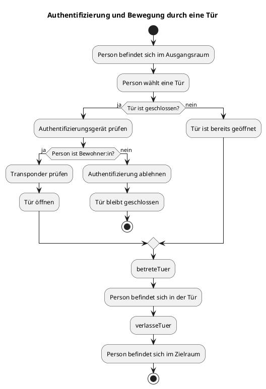

## Einleitung und Ziel der Arbeit

In dieser Arbeit wird ein Zugangskontrollsystem modelliert, in dem sich Personen zwischen verschiedenen Räumen bewegen können. Der Zugang zu einzelnen Räumen erfolgt über geöffnete Türen.

Mithilfe von Alloy werden mögliche Systemzustände und Abläufe über Verfeinerungsschritte untersucht. Lean wird verwendet, um ausgewählte Eigenschaften mathematisch beziehungsweise formal zu beweisen.

## Einführung und Ziel

Ein Zugangskontrollsystem regelt, welche Personen die Türen zu bestimmten Räumen öffnen dürfen, der den Raumwechsel möglich macht.

In einem Smart-Home-System müssen dabei mehrere Aspekte berücksichtigt werden:

- Wo befindet sich eine Person aktuell?
- Welche Räume und Türen gibt es?
- Welche Räume sind miteinander verbunden?
- Ist eine Tür geöffnet oder geschlossen?
- Darf eine Person die Tür öffnen?
<!-- - Was passiert während des Durchgangs durch die Tür? -->

Um diese Fragen schrittweise zu beschreiben, wird das System in drei Modellschritten betrachtet:

1. **Grobe Bewegung zwischen zwei Räumen**
2. **Detaillierte Bewegung durch eine Tür**
3. **Authentifizierung und Steuerung der Tür**

Als Beispiel werden **Bernd** (welcher seinem Gefängnis entkommen ist und daher nun an der Hochschule Rhein-Main arbeitet) und sein Gast **Sandmännchen** verwendet:

## Grundlegende räumliche Struktur

Um die Idee des Projektes zu visualisieren, kann die grundlegende Raumstruktur mithilfe eines Raumplans für das Gebäude D vorgestellt werden, in dem sich Bernd und das Sandmännchen treffen.

Grundlegend können sich Personen in Orten aufhalten. Die im System betrachteten Orte werden in zunächst zwei Arten unterteilt: Gärten und Räume. Der Garten bildet den Außenbereich und damit den Ausgangspunkt für Personen, die das Gebäude betreten möchten. Räume beschreiben die innerhalb des Gebäudes liegenden Bereiche, beispielsweise Flure, Vorlesungsräume oder Büros.

Das Gebäude besteht aus mehreren Bereichen:

- einer Außenanlage beziehungsweise einem Garten,
- allgemein zugänglichen Räumen (beispielsweise den Vorlesungsräumen und Büros),
- Türen zwischen den einzelnen Bereichen (die offen oder geschlossen sein können).

Die Räume werden über Türen miteinander verbunden. Eine Tür verbindet dabei jeweils zwei benachbarte Bereiche. In späteren Verfeinerungsschritten werden auch Türen als Orte betrachtet, in denen sich Personen aufhalten können.

## Beispiel: Bernd zeigt Sandmännchen das D Gebäude

Bernd arbeitet in der Hochschule Rhein-Main. Das Gebäude D, in welchem er arbeitet, besteht aus einem Garten und mehreren Räumen, die er betreten kann, wenn sie durch eine Tür miteinander verbunden sind. <!-- Einige der Räume sind für alle betretbar, wie beispielsweise die Flure und die Vorlesungsräume. -->

Zu Beginn befinden sich Bernd und Sandmännchen im Garten:

- Bernd ist "Bewohner" des Hauses.
- Sandmännchen ist ein Gast.
- Beide Personen befinden sich im Garten.
- Alle Türen sind geschlossen.
- Sandmännchen besitzt keine Berechtigung, eine Tür zu öffnen.

Die Bewegungen innerhalb des Gebäudes D von Bernd und Sandmännchen lassen sich nun in unterschiedlichen Detailebenen betrachten.

## Unterschiedliche Betrachtungsebenen des Besuchs

Für die spätere Modellierung in Alloy ist es nun sinnvoll, mit einer groben Spezifikation der Anforderungen an das System zu beginnen, um in weiteren Verfeinerungsschritten neue Anforderungen zu finden, und diese als jeweils nächsten Verfeinerungsschritt einzubinden. Wir verfolgen mit diesen Spezifikaitonsschritten den Event-B-Ansatz.

Es gibt nun entsprechend unterschiedliche Betrachtungsebenen, auf denen unterschiedlich viele Informationen vom Besuch von Sandmännchen sichtbar sind. Wir unterscheiden zwischen drei Stufen, welche nachfolgend anhand des Besuchs von Sandmännchen spezifiziert werden. Jede tieferliegende Stufe stellt dabei eine Black-Box für die jeweils darüberliegenden dar.

1. Die Anforderung im groben Modell besteht darin, dass sich Bernd und Sandmännchen zwischen benachbarten Räumen bewegen können. Um den Grundplan für weitere Spezifikationsschritte legen zu können, wurden hier bereits Türen zwischen den Räumen definiert, die beim Betreten des neuen Raums geöffnet sein müssen.

2. Da ein Raumwechsel allerdings durch eine Tür stattfinden soll, und beim Betreten des nächsten Raumes nicht nur eine offene Tür als Voraussetzung gelten soll, sondern auch dass nicht unendlich viele Personen durch die Tür passen, ist es in diesem Verfeinerungsschritt notwendig, dass eine Person in einem Zwischenschritt sich in der Tür befindet. Dort soll immer nur jeweils eine Person hineinpassen. Bernd und Sandmännchen können also nun einzeln durch die Tür gehen, um dann den Vorlesungsraum zu betreten.

3. Türen in der Hochschule sind allerdings nicht immer offen. Es muss also ebenfalls einen Mechanismus geben, um geschlossene Türen öffnen zu können. Möchte Bernd nun sein Büro seinem Gast Sandmännchen zeigen und es ist gerade verschlossen, muss er zunächst mit seinem Transponder das Büro, und damit die Tür, aufschließen. Ist die Tür dann offen, kann er das Büro betreten. Hält Bernd die Tür für das Sandmännchen offen, damit diese nicht zufällt, kann auch das Sandmännchen den Raum betreten. Anschließend kann die Tür aber nach einer beliebigen Zeit wieder zufallen. Geschlossene Türen können dabei nur von Personen geöffnet werden, die in der HS arbeiten sind und daher einen Transponder haben.

## Fachliche Beschreibung der Objekte

Aus dem [Gebäudeplan](#raumplan-und-räumliche-struktur) und den [Detailebenen des Besuchs](#beispiel-detailebenen-des-besuchs) ergeben sich nun verschiedene beteiligte Elemente in der Domäne sowie realitätserhaltende Grundregeln. Diese werden nachfolgend erläutert.

### Beteiligte Elemente

Das Zugangskontrollsystem, wie oben beschrieben, hat auf allgemeiner Ebene verschiedene Elemente. Diese sind, ohne Beschreibung ihrer Aufgaben, folgende:

| Element | Bedeutung |
| :--- | :--- |
| Person | Eine Person, die sich im den Orten eines Gebäudes bewegt |
| Bewohner:in | Eine Person mit Berechtigung zum Türenöffnen |
| Gast | Eine Person ohne Berechtigung zum Türenöffnen |
| Raum | Ein Ort, in dem sich Personen aufhalten können |
| Garten | Ein Ort, außerhalb des Gebäudes |
| Tür | Verbindet zwei Räume |
| Authentifizierung | Technische Einrichtung zur Identitäts- oder Berechtigungsprüfung |

### Grundregeln

Darüber hinaus gibt es bestimmte Regeln, die in der Realität immer gelten. Diese sollten daher als Axiome modelliert werden. Diese Grundregeln sollten als verständliche Anforderungen formuliert werden:

- Jede Person befindet sich immer genau an einem Ort.
- Eine Tür verbindet genau zwei Räume.
- Eine Tür kann geöffnet oder geschlossen sein.
- Eine Person darf eine Tür nur bei geöffneter Tür passieren.
<!-- - Der Bewegungszustand darf keine Teleportation ermöglichen. -->

Sollten diese Bedingungen verletzt werden, sind wohl weder Bernd noch Sandmännchen sicher und befinden sich in akuter Diese-welt-existiert-so-nicht-gefahr. Wir schließen diese daher zur Wahrung eines realitätsnahen Ansatzes aus.

Über diese grundlegenden Gesetze hinaus, gibt es noch weitere definierte Axiome, die die Umsetzung des D Gebäude möglich machen:

- alle Räume sind von allen Räumen aus erreichbar und befinden sich entsprechend im gleichen Gebäude
- es gibt um das Gebäude herum einen einzigen Garten als Außenbereich
- jeder Nachbarraum eines Raums ist wiederum Nachbar des Nachbarraums

### Abstraktes Datenmodell

Es folgt ein Klassen- und Beziehungsdiagramm für die Grundkomponenten:

**Personen**:
PERSON beschreibt die allgemeine Menge aller Personen. Bewohner:innen und Gäste sind spezielle Arten von Personen.

**Orte**:
Ein Ort kann Personen enthalten und Nachbarn besitzen. Das Feld `hat Nachbarn` beschreibt, welche Orte miteinander verbunden sind. Dabei haben Türen immer Räume als Nachbarn und Türen immer Räume als Nachbarn. Die Beziehungen zu den Nachbarn sind immer symmetrisch.

**Türen und Räume**:
Räume und Türen sind beide Orte. Dadurch können Personen im feinen Modell vorübergehend auch innerhalb einer Tür dargestellt werden. Eine Tür besitzt einen Öffnungszustand und genau ein Authentifizierungsgerät.

# Modellspezifikation

Die fachlichen Anforderungen sind in der [Modellspezifikation](./Modellspezifikation.md) beschrieben. Im Folgenden wird erklärt, wie diese Anforderungen in Alloy und Lean als Modell umgesetzt und bewiesen wurden.

# Modellierung in Alloy

Die Umsetzung des Modells in Alloy basiert auf den Anforderungen der Spezifikation. Dabei sind die Spezifikationsschritte auf Basis der Umsetzung des vorherigen Schritts verfeinert worden.

Zunächst wurden die grundlegenden Objekte und deren Beziehungen über Signaturen in Alloy modelliert (siehe [Grundregeln](#Grundregeln)). 

Bereits aufgelistete Axiome wurden dabei in Alloy als facts definiert, damit diese bei jedem Durchlauf des Modells greifen. Dazu gehören Eigenschaften wie:

- Jede Person befindet sich immer genau an einem Ort.
- Eine Tür verbindet genau zwei Räume.
- Eine Tür kann geöffnet oder geschlossen sein.
- Eine Person darf eine Tür nur bei geöffneter Tür passieren.

Ebenfalls als facts wurden die Strukturen definiert, die die Struktur des Gebäudes ausmachen [Grundregeln]:

- alle Räume sind von allen Räumen aus erreichbar und befinden sich entsprechend im gleichen Gebäude
- es gibt um das Gebäude herum einen einzigen Garten als Außenbereich
- jeder Nachbarraum eines Raums ist wiederum Nachbar des Nachbarraums

## Event-B

### Umsetzung des Groben Modells

Um erste Bewegungsabläufe von Personen zwischen Räumen modellieren zu können <!--, jedoch bereits den Grundaufbau des Gebäudes für die nächsten Verfeinerungsschritte vorzubereiten,--> haben wir zunächst Personen und unterschiedliche Orte als Räume und Gärten definiert. Eine Person kann sich in einem Ort aufhalten.

Personen können nun zwischen benachbarten Räumen wechseln. Dafür enthält jeder Raum eine Liste aus Nachbarräumen. Wichtig ist, dass Nachbarräume symmetrisch sind, weshalb wir dies als fact in Alloy für unsere Raumstruktur festgelegt haben (siehe Alloymodell: fact alleNachbarnSindSymmerisch).

Die Bewegung wurde definiert als das Entfernen der Person aus Raum A und das Hinzufügen dieser in den benachbarten Raum B (siehe Alloymodell: pred move).

In diesem Schritt ändern sich daher nur die Personen der beiden beteiligten Räume. Für alle anderen Räume wird durch eine Frame-Condition definiert, dass sich die Personen in diesen Räumen nicht ändern.

### Umsetzung des Feinen Modells

Im feinen Modell wurden nun Türen zwischen den Räumen modelliert, durch die die Personen gehen müssen, um in einen benachbarten Raum zu wechseln. Der Wechsel in den benachbarten Raum teilt sich nun in zwei Zwischenschritte auf: 

1. Die Person betritt die Tür
2. Die Person verlässt die Tür

Eine eingeführte Voraussetzung ist, dass die Tür, durch die eine Person gehen möchte, geöffnet sein muss. Dies haben wir als pre-Bedingung festgehalten (siehe Alloymodell: pred betreteTuer).

Da an dieser Stelle für einen einzelnen Schritt im groben Modell zwei Schritte im feinen Modell notwendig sind. Ist die Einführung eines ersten Stutter-Vorgangs im groben Modell wichtig.

Ziel ist, dass das Ergebnis des feinen Modells auch im Ergebnis des groben Modells vorhanden sein soll. Zwischenschritte des feinen Modells sind entsprechend als Blackbox im groben Modell zu betrachten.

|  | Schritt 1 | Schritt 2 |
|----------|----------|----------|
| Grob   | Stutter   | betreteRaum   |
| Fein   | betreteTuer   | verlasseTuer   |

In diesem Stutter-Vorgang ist festgelegt, dass sich die Person im groben Modell nicht bewegt. Dies wurde mit einer Frame-Condition ermöglicht, die definiert, dass sämtliche Personen in dem Modell in ihrem aktuellen Raum bleiben.

Ziel war es, wenn sich eine Person im feinen Modell in Raum A, befindet, dass dies auch für das grobe Modell gilt.

Wenn die Person allerdings die Tür verlässt und Raum B betritt, soll das für das grobe Modell ebenfalls gelten.

Wenn die Person im feinen Modell in der Tür steht, ist das aus Sicht des groben Modells betrachtet, eine Blackbox:

### Umsetzung der Authentifizierung

Im zweiten Verfeinerungsschritt, wurde nun die Voraussetzung eingeführt, dass Bewohner sich authentifizieren müssen, um eine Tür zwischen benachbarten Räumen öffnen zu können. Wenn die Tür geöffnet wurde, besteht für Personen wieder die Möglichkeit eines Raumwechsels.

Da sich nur Bewohner Authentifizieren können, ist es nun notwendig, Personen in Bewohner und Gäste aufzuteilen. Das Bewegen zwischen Räumen mit einer verschlossenen Tür wird für Gäste also erst möglich, wenn ein Bewohner die Tür vorher aufgeschlossen hat.

Für eine bessere Visualisierung wurde ich nachfolgenden Grafiken ein Authentifizierungsobjekt eingeführt, dieses ist in Alloy allerdings nicht explizit vorhanden, die Autorisierung findet hier direkt über die Tür statt. 

### Synchronisierung der Modellebenen

Da das grobe Modell als Blackbox für die verfeinerten Schritte betrachtet werden kann, allerdings die Ergebnisse der feineren Modelle sich im groben Modell widerspiegeln müssen, ist es nun notwendig, die Abläufe der Verfeinerungsgrade zu synchronisieren. Dabei wird für jede neu hinzugefügten Verfeinerungsschritt ein Stutter-Vorgang im darunterliegenden Modell eingeführt.

Betrachtet man beispielsweise den ersten Schritt der Autorisierung, darf Alloy in keinem der Modelle Änderungen der Invarianten vornehmen, ausgenommen, dass sich die Verbindungstür der Nachbarräume öffnet. Im Stutter des ersten Schritts auf allen Modell-Ebenen dürfen entsprechend die Personen des Groben und feinen Modells, die Variable des letzten Raumes der Personen und die restlichen Türen nicht verändert werden (siehe Alloymodell: StutterSchritt_1).

Insgesamt ergibt sich folgende Tabelle der Modell-Vorgänge:

|  | Schritt 1 | Schritt 2 | Schritt 3 |
|----------|----------|----------|----------|
| Grob   | Stutter   | Stutter   | betreteRaum |
| Fein   | Stutter   | betreteTuer   | verlasseTuer |
| Auth   | Tuer oeffnen   | betreteTuer   | verlasseTuer |
| Stutter| Stutter_1    | Stutter_2    |      |

Gleiche Modell-Vorgänge grafisch visualisiert:

Da das Modell immer nur Schritte einzelner Personen ausführt und auch beim Türenöffnen immer nur ein Objekt explizit angesprochen wird, ist es nun notwendig, Alloy durch Frame Contitions daran zu hindern, weitere, nicht explizit definierte Schritte im Modell auszuführen. Das wird in den einzelnen Zustandsübergängen durch Frame-Conditions ermöglicht, die die Änderung restlicher gleicher Objekte untersagt (siehe Alloy-Modell: betreteTuer, verlasseTuer). Dabei reichen die Frame-Conditions in den feineren Ebenen aus, da diese auch automatisch für das Grobe modell gelten.

## Zusammengefasste Ablaufschritte der zweiten Verfeinerung

**Aktivitätsdiagramm**
-->

## Beweisen mit Lean

## Fazit und Ausblick

<!-- Erscheint mir mehr wie eine Zusammenfassung und weniger als Fazit -->

In dieser Arbeit wurde ein Zugangskontrollsystem modelliert, in dem sich Personen zwischen verschiedenen Räumen bewegen können. Dabei wurden Räume, Türen, Personen, Berechtigungen und Authentifizierungsgeräte berücksichtigt.

Das System wurde insgesamt schrittweise in drei Modellen beschrieben, die jeweils aufeinander aufbauen. Aufbauend auf den Modellierungen, wie sie in Alloy vorliegen, konnten in Lean entsprechende Modelle und Vorgänge nachgebaut und bewiesen werden.

Das System wurde schrittweise in drei Modellen beschrieben. Mit dem Groben Modell haben wir den gewünschten Anfangs- und Endzustand modelliert. Die Ergebnisse der verfeinerten Modelle sollten denen des Groben Modells gleich sein.

In einem verfeinerten Schritt haben wir die Zwischenschritte in den Türen hinzugefügt. Diese bilden die Grundlage für die Authentifizierung, da Personen ohne Berechtigung in einem weiteren Schritt Türen nicht passieren dürfen. 

In dem Schritt der Authentifizierung wurde nun eine erste Bedingung hinzugefügt, dass Personen Bewohner sein müssen, damit sie Türen öffnen können. Diese Verfeinerung könnte einerseits durch weitere Bedingungen ausgebaut werden.

Wenn man das System wiederum nach Event-B ausarbeiten möchte, könnte man den jetzigen Authentifizierungsschritt wiederum als Blackbox betrachten und in der Hinsicht das System um weitere Logik durch das Hinzufügen von Verfeinerungsschritten ergänzen.

So könnte beispielsweise die Authentifizierung nicht nur überprüfen, ob es sich bei der Person um einen Bewohner handelt, sondern auch, dass eine maximale Kapazität des Raumes eingehalten wird. Es könnten aber auch andere Abhängigkeiten modelliert werden, beispielsweise dass Räume nur zu bestimmten Uhrzeiten betreten werden dürfen. Da es gerade bei der Authentifizierung sehr viele Möglichkeiten gibt, Raumzugänge zu regeln, wäre hier eine breite Komplexität in diesem Verfeinerungsschritt möglich. Dabei könnte eine Struktur zur Hinterlegung dieser Regeln entwickelt werden, beispielsweise könnte jeder Raum, je nach Raumtyp, eigene Regeln besitzen, die von einem Authentifizierungsgerät ausgelesen und auf jeweilige externe Gegebenheiten, beispielsweise Personentypen, Wetterbedingungen oder Uhrzeiten, angewendet werden können. Auch könnten mögliche parallele Authentifizierungen von Personen in gleichen Räumen modelliert werden und eventuelle Regelverletzungen der Authentifizierung in solchen Situationen erkannt, und entsprechende Spezifikationslücken geschlossen werden.

Insgesamt bildet das Modell eine vereinfachte, aber erweiterbare Grundlage für die formale Beschreibung eines Zugangskontrollsystems.