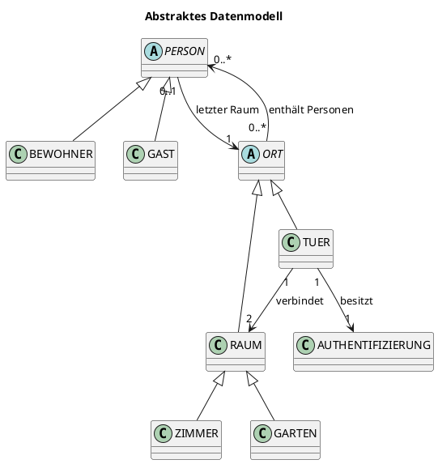
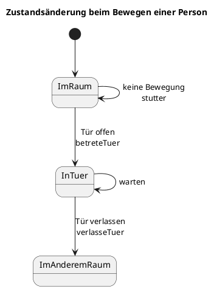
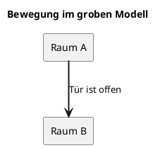
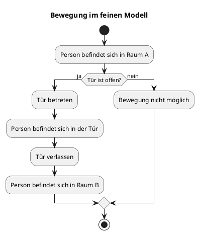
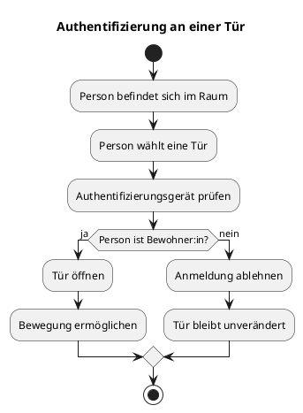
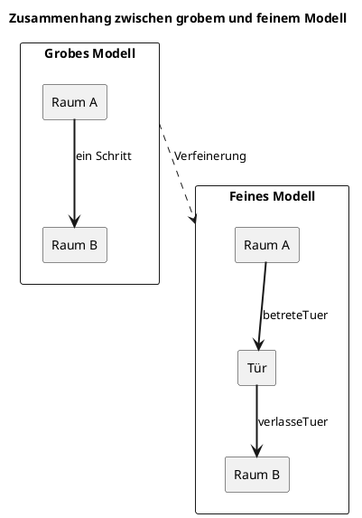

## Einleitung und Ziel der Arbeit

In dieser Arbeit wird ein System modelliert, in dem sich Personen zwischen verschiedenen Räumen bewegen können. Der Zugang zu einzelnen Räumen erfolgt über Türen. Türen können geöffnet oder geschlossen sein und benötigen gegebenenfalls eine Authentifizierung.

Mithilfe von Alloy werden mögliche Systemzustände und Abläufe automatisch untersucht. Lean wird verwendet, um ausgewählte Eigenschaften mathematisch beziehungsweise formal zu beweisen.

## Das Problem

Ein Zugangssystem regelt, welche Personen bestimmte Räume betreten dürfen und unter welchen Bedingungen ein Raumwechsel möglich ist.

In einem Smart-Home-System müssen dabei mehrere Aspekte berücksichtigt werden:

- Wo befindet sich eine Person aktuell?
- Welche Räume und Türen gibt es?
- Welche Räume sind miteinander verbunden?
- Ist eine Tür geöffnet oder geschlossen?
- Darf eine Person die Tür öffnen?
- Was passiert während des Durchgangs durch die Tür?

Um diese Fragen schrittweise zu beschreiben, wird das System in drei Modellschritten betrachtet:

1. **Grobe Bewegung zwischen zwei Räumen**
2. **Detaillierte Bewegung durch eine Tür**
3. **Authentifizierung und Steuerung der Tür**

Als Beispiel werden **Bernd** (welcher seinem Gefängnis entkommen ist und daher nun an der Hochschule RheinMain arbeitet) und sein Gast **Sandmännchen** verwendet:


## Raumplan und räumliche Struktur

Um uns näher an das Modell heranzutasten, schauen wir uns zunächst allgemein einen Raumplan an.

Ein beispielhafter Raumplan könnte für ein öffentliches Gebäude so aussehen (und ist ganz zufällig auch der Ort an dem Bernd und Sandmännchen sich in unserem Beispiel treffen). Die Darstellung hier ist dabei eine vereinfachte Abbildung des Gebäudes. Es werden daher nur die für die Zutrittskontrolle und die Bewegung von Personen relevanten Eigenschaften berücksichtigt. Bauliche Details wie Wandstärken, Treppen, Möbel oder genaue Entfernungen spielen für die formale Spezifikation keine Rolle.


Der Zugang zum Gebäude erfolgt über eine Außenanlage beziehungsweise einen Garten. Dieser Bereich bildet den Ausgangspunkt für die Personen, bevor sie das Gebäude betreten.

Das Gebäude besteht aus mehreren Bereichen:

- einer Außenanlage beziehungsweise einem Garten,
- allgemein zugänglichen Räumen (beispielsweise den Vorlesungsräumen),
- Büros (weiß, ohne Namen),
- Türen zwischen den einzelnen Bereichen (die offen oder geschlossen sein können).

Die Räume werden über Türen miteinander verbunden. Eine Tür verbindet dabei jeweils zwei benachbarte Bereiche.

## Beispiel: Bernd und sein Gast Sandmännchen

Bernd arbeitet in der Hochschule RheinMain. Das Gebäude D, in welchem er arbeitet, besteht aus einem Garten und mehreren Zimmern. Zwischen den Bereichen befinden sich Türen. Einige der Räume sind für alle betretbar, wie beispielsweise die Flure und die Vorlesungsräume. Andere Räume, wie die Büros, sind aber nur dann betretbar, wenn die Tür authentifiziert werden kann und daher offen ist.

Zu Beginn befinden sich beide Personen im Garten:

- Bernd ist Bewohner des Hauses.
- Sandmännchen ist ein Gast.
- Beide Personen befinden sich im Garten.
- Alle Türen sind geschlossen.
- Sandmännchen besitzt keine dauerhafte Berechtigung, eine Tür zu öffnen.

Der beispielhafte Raumplan von Gebäude D sieht folgendermaßen aus:


Die Bewegungen innerhalb des Gebäudes D von Bernd und Sandmännchen lassen sich nun in unterschiedlichen Detailebenen betrachten.

## Beispiel: Detailebenen des Besuchs

Es gibt nun unterschiedliche Zoom-Ebenen, auf denen wir unterschiedlich viel vom Besuch von Sandmännchen anschauen können. Wir beschreiben daher unser Zugangskontrollsystem als Event-B-Ansatz. Wir unterscheiden zwischen drei Stufen, welche nachfolgend anhand des Besuchs von Sanndmännchen hergeleitet werden.

1. Im ersten Modell bewegen sich Personen direkt von einem Raum in einen anderen. Bernd und Sandmännchen können hier also einfach durch einen Raum zu einem anderen gehen, vorausgesetzt die Tür ist offen.


2. Bei genauerer Betrachtung des ersten Modells fällt auf, dass wir die Tür gerade unbeachtet lassen. Im zweiten Modell durchqueren Personen daher zunächst die Tür und befinden sich für einen Übergangszustand innerhalb der Tür. Bernd und Sandmännchen gehen hier nun also nicht direkt vom Flur in den Vorlesungsraum. Sie verlassen zunächst den Flur, betreten die offene Tür und betreten dann erst den Vorlesungsraum.


3. Türen sind aber in einer Hochschule nicht immer offen. Es muss also ebenfalls einen Mechanismus geben, um in geschlossene Türen zu kommen. Beispielsweise das Büro von Bernd. Will er dieses seinem Gast Sandmännchen zeigen und es ist gerade verschlossen, muss er zunächst mit seinem Transponder das Büro, und damit die Tür, aufschließen. Ist die Tür dann offen, können er und Sandmännchen das Büro betreten. Im dritten Modell besitzen die Türen daher eine Authentifizierung. Ist die Tür geschlossen, lässt sie sich so wieder öffnen. Geschlossene Türen können dabei nur von Personen geöffnet werden, die Bewohner sind und daher einen Transponder haben


## Fachliche Beschreibung des Systems

Aus dem [Gebäudeplan](#raumplan-und-räumliche-struktur) und den [Detailebenen des Besuchs](#beispiel-detailebenen-des-besuchs) ergeben sich nun verschiedene beteiligte Elemente in der Domäne. Diese werden nachfolgend erläutert.

### Beteiligte Elemente

Das Zugangskontrollsystem, wie oben beschrieben, hat auf allgemeiner Ebene verschiedene Elemente. Diese sind, ohne Beschreibung ihrer Aufgaben, folgende:

| Element | Bedeutung |
| :--- | :--- |
| Person | Eine Person, die sich im System bewegt |
| Bewohner:in | Eine Person mit dauerhafter Berechtigung für den Zutritt |
| Gast | Eine Person ohne dauerhafte Berechtigung |
| Raum | Ein Bereich, in dem sich Personen aufhalten können |
| Tür | Verbindet zwei Räume |
| Authentifizierung | Technische Einrichtung zur Identitäts- oder Berechtigungsprüfung |

### Grundregeln

Darüber hinaus gibt es bestimmte Regeln, die in der Realität immer gelten. Diese sollten daher mit modelliert werden. Die wichtigsten Grundregeln sollten als verständliche Anforderungen formuliert werden:

* Jede Person befindet sich immer genau an einem Ort.
* Eine Tür verbindet genau zwei Räume.
* Eine Tür kann geöffnet oder geschlossen sein.
* Eine Person darf eine Tür nur bei geöffneter Tür passieren.
* Der Bewegungszustand darf keine Teleportation ermöglichen.

Sollten diese Bedinungen verletzt werden, sind wohl weder Bernd noch Sandmännchen sicher und befinden sich in akuter diese-welt-existiert-so-nicht-gefahr. Wir schließen diese daher zur Wahrung eines realitätsnahen Ansatzes aus.

## Abstraktes Datenmodell

Hier wird erklärt, aus welchen Objekten das System besteht und wie diese zusammenhängen.

### Klassen- und Beziehungsdiagramm



**Personen**:
PERSON beschreibt die allgemeine Menge aller Personen. Bewohner:innen und Gäste sind spezielle Arten von Personen. Das Feld `letzterRaum` speichert den letzten Raum, in dem sich eine Person befunden hat.

**Orte**:
Ein Ort kann Personen enthalten und Nachbarn besitzen. Das Feld `nachbarn` beschreibt, welche Orte miteinander verbunden sind.

**Türen und Räume**:
Räume und Türen sind beide Orte. Dadurch können Personen im feinen Modell vorübergehend auch innerhalb einer Tür dargestellt werden. Eine Tür besitzt einen Öffnungszustand und genau ein Authentifizierungsgerät.

## Zeit und Zustandsänderungen TODO

Das System besteht dabei nicht nur aus einem unveränderlichen Zustand, sondern aus einer Folge von Zuständen:

```text
Zustand 0  -- Bewegung -->  Zustand 1  -- Tür schließen --> Zustand 2

todo als Bild beschreiben
```

Beispielsweise möchte Bernd das Zimmer 1 betreten ... TODO

Es muss daher möglich sein das System dahingehend zu modellieren. Für diese Modellierung nach Zuständen nutzen wir das Event B Modell/ Zustände ??

**PlantUML-Zustandsdiagramm**



Wir haben daher unser Modell in verschiedene Verfeinerungsstufen eingeteilt. Deren Details und Erklärungen folgen nun.

## Grobes Modell
Das grobe Modell beschreibt Bewegungen auf einer vereinfachten Ebene.

Im groben Modell wird eine Bewegung direkt als Wechsel von einem Raum in einen anderen dargestellt. Die Tür wird dabei nicht als eigener Zwischenaufenthaltsort betrachtet. Es wird lediglich geprüft, ob eine geeignete offene Tür zwischen beiden Räumen existiert.

**Beispiel**

Bernd kann hier also ... TODO

**Diagramm**



In diesem Schritt ändern sich nur die Aufenthaltsmengen der beiden beteiligten Räume. Andere Räume, Türen und der letzte bekannte Raum einer Person bleiben unverändert.

## Feines Modell

Das feine Modell stellt den Bewegungsablauf detaillierter dar. Eine Person bewegt sich in zwei Schritten:

1. Die Person betritt eine Tür.
2. Die Person verlässt die Tür und betritt den Zielraum.

**Beispiel**

Bernd kann hier also ... TODO

**Ablaufdiagramm**



Die Bewegung ist damit in zwei Schritte aufgeteilt worden, nämlich in **betreteTuer** und **verlasseTuer**:

Das Prädikat `betreteTuer` beschreibt den ersten Teil der Bewegung. Die Person muss sich im Ausgangsraum befinden, die Tür muss Nachbar des Raums sein und geöffnet sein. Anschließend wird die Person aus dem Raum entfernt und in die Tür aufgenommen.

Das Prädikat `verlasseTuer` beschreibt den zweiten Teil der Bewegung. Die Person muss sich in der Tür befinden. Der Zielraum muss mit der Tür verbunden sein. Danach wird die Person aus der Tür entfernt und in den Zielraum aufgenommen.

## Feineres Modell: Authentifizierung und Türsteuerung

Eine weitere Verfeinerungsstufe schaut sich nun die Authentifizierung an...

**Beispiel**

Bernd erklärt die unten stehenden Regeln...TODO

* Nur Bewohner:innen können sich anmelden.
* Eine Anmeldung erfolgt an einer Tür.
* Bei erfolgreicher Anmeldung wird die Tür geöffnet.
* Bei einer fehlgeschlagenen Anmeldung bleibt der Zustand unverändert.
* Das Öffnen einer Tür verändert keine anderen Türen.

**Aktivitätsdiagramm**



Die Dokumentation sollte anschließend erklären, welche Teile Vorbedingungen, Nachbedingungen und Frame Conditions sind TODO.

| Bereich | Bedeutung |
| :--- | :--- |
| **Vorbedingung** | Was vor der Aktion gelten muss |
| **Nachbedingung** | Was nach der Aktion gilt |
| **Frame Condition** | Was unverändert bleibt |

## Systemgarantien

In diesem Kapitel werden die Eigenschaften beschrieben, die immer gelten sollen.

- Das System enthält zu jedem Zeitpunkt genau einen Garten.
- Jede Person muss sowohl im groben als auch im feinen Modell immer genau einem Ort zugeordnet sein.
- Jede Tür besitzt genau zwei benachbarte Räume. Sie verbindet also einen Ausgangsraum mit einem Zielraum.
- TODOs

## Konsistenz zwischen den Modellen

**Grundidee**
Das grobe Modell überspringt den Aufenthalt in der Tür:

```text
Raum A  -------------------->  Raum B
```

Das feine Modell bildet denselben Vorgang detaillierter ab:

```text
Raum A  ---->  Tür  ---->  Raum B
```

Das verfeinerte dritte Modell widerum bildet noch eine Authentifizierung bei der Tür ab:

```text
Raum A  ---->  Tür (Authentifizierung nötig)  ---->  Raum B
```

**Abbildung**



Jeder zulässige Ablauf im feinen Modell muss daher mit dem groben Modell vereinbar sein. Der zusätzliche Zwischenzustand innerhalb der Tür darf also nicht zu einem anderen fachlichen Ergebnis führen. Die Verfeinerung ist erfolgreich, wenn beide Modelle nach Abschluss einer Bewegung dieselbe Raumzuordnung der Personen liefern.

## Fazit und Ausblick

Das Fazit sollte beantworten: TODO
* Was wurde modelliert?
* Welche Eigenschaften wurden überprüft?
* Welche Rolle spielen Alloy und Lean?
* Welche Erweiterungen wären möglich?

**Mögliche Erweiterungen:**
* mehrere Gärten oder Außenbereiche
* unterschiedliche Berechtigungsstufen
* mehrere Authentifizierungsgeräte
* Türen mit automatischem Schließen
* gleichzeitige Bewegungen mehrerer Personen
* Alarmzustände bei unberechtigtem Zutritt
* zusätzliche Raumtypen
* vollständige formale Beweise der Verfeinerung