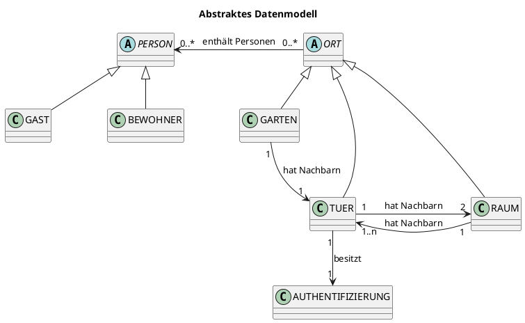
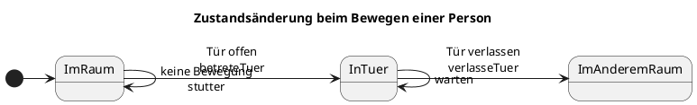
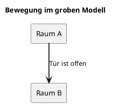
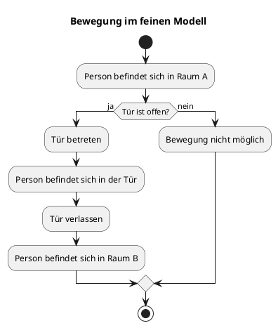
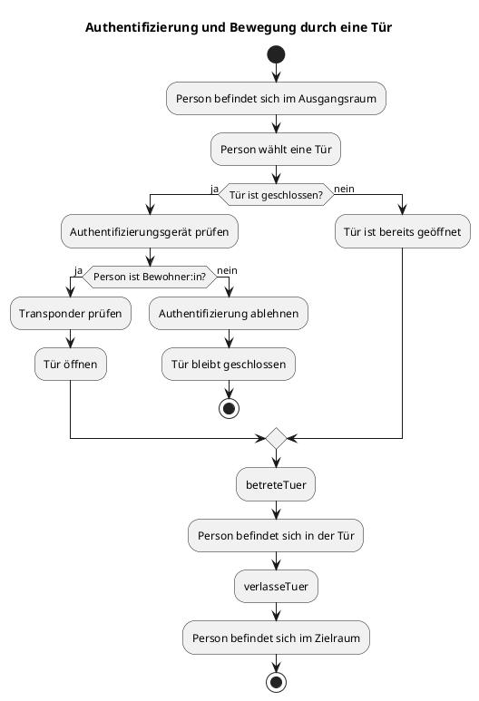
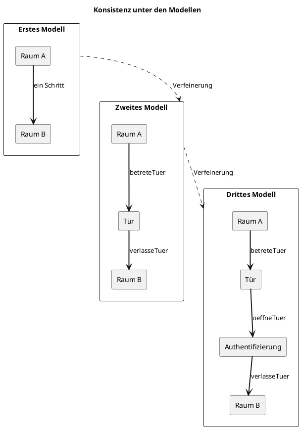

## Einleitung und Ziel der Arbeit

In dieser Arbeit wird ein Zugangskontrollsystem modelliert, in dem sich Personen zwischen verschiedenen Räumen bewegen können. Der Zugang zu einzelnen Räumen erfolgt über geöffnete Türen.

Mithilfe von Alloy werden mögliche Systemzustände und Abläufe über Verfeinerungsschritte untersucht. Lean wird verwendet, um ausgewählte Eigenschaften mathematisch beziehungsweise formal zu beweisen.

## Einführung und Ziel

Ein Zugangskontrollsystem regelt, welche Personen die Türen zu bestimmten Räumen öffnen dürfen, der den Raumwechsel möglich macht.

In einem Smart-Home-System müssen dabei mehrere Aspekte berücksichtigt werden:

- Wo befindet sich eine Person aktuell?
- Welche Räume und Türen gibt es?
- Welche Räume sind miteinander verbunden?
- Ist eine Tür geöffnet oder geschlossen?
- Darf eine Person die Tür öffnen?
<!-- - Was passiert während des Durchgangs durch die Tür? -->

Um diese Fragen schrittweise zu beschreiben, wird das System in drei Modellschritten betrachtet:

1. **Grobe Bewegung zwischen zwei Räumen**
2. **Detaillierte Bewegung durch eine Tür**
3. **Authentifizierung und Steuerung der Tür**

Als Beispiel werden **Bernd** (welcher seinem Gefängnis entkommen ist und daher nun an der Hochschule RheinMain arbeitet) und sein Gast **Sandmännchen** verwendet:


## Grundlegende räumliche Struktur

Um die Idee des Projektes zu visualisieren, kann die grundlegende raumstruktur mithilfe eines Raumplans für das Gebäude D vorgestellt werden, in dem sich Bernd und das Sandmännchen treffen.

<!-- 
Ein beispielhafter Raumplan könnte für ein öffentliches Gebäude so aussehen (und ist ganz zufällig auch der Ort an dem Bernd und Sandmännchen sich in unserem Beispiel treffen). Die Darstellung hier ist dabei eine vereinfachte Abbildung vom Gebäudes. Es werden daher nur die für die Zutrittskontrolle und die Bewegung von Personen relevanten Eigenschaften berücksichtigt. Bauliche Details wie Wandstärken, Treppen, Möbel oder genaue Entfernungen spielen für die formale Spezifikation keine Rolle. -->


Grundlegend können sich Personen in Orten aufhalten. Die im System betrachteten Orte werden in zunächst zwei Arten unterteilt: Gärten und Räume. Der Garten bildet den Außenbereich und damit den Ausgangspunkt für Personen, die das Gebäude betreten möchten. Räume beschreiben die innerhalb des Gebäudes liegenden Bereiche, beispielsweise Flure, Vorlesungsräume oder Büros.

Das Gebäude besteht aus mehreren Bereichen:

- einer Außenanlage beziehungsweise einem Garten,
- allgemein zugänglichen Räumen (beispielsweise den Vorlesungsräumen und Büros),
- Türen zwischen den einzelnen Bereichen (die offen oder geschlossen sein können).

Die Räume werden über Türen miteinander verbunden. Eine Tür verbindet dabei jeweils zwei benachbarte Bereiche. In späteren Vereinerungsschritten werden auch Türen als Orte betrachtet, in denen sich Personen aufhalten können.

<!-- -->
## Beispiel: Bernd zeigt Sandmännchen das D Gebäude

Bernd arbeitet in der Hochschule RheinMain. Das Gebäude D, in welchem er arbeitet, besteht aus einem Garten und mehreren Räumen, die er betreten kann, wenn sie durch eine Tür miteinander verbunden sind. <!-- Einige der Räume sind für alle betretbar, wie beispielsweise die Flure und die Vorlesungsräume. -->

Zu Beginn befinden sich Bernd und Sanndmännchen im Garten:

- Bernd ist Bewohner des Hauses.
- Sandmännchen ist ein Gast.
- Beide Personen befinden sich im Garten.
- Alle Türen sind geschlossen.
- Sandmännchen besitzt keine Berechtigung, eine Tür zu öffnen.
<!--
Der beispielhafte Raumplan von Gebäude D sieht folgendermaßen aus:

 -->

Die Bewegungen innerhalb des Gebäudes D von Bernd und Sandmännchen lassen sich nun in unterschiedlichen Detailebenen betrachten.

## Unterschiedliche Betrachtungsebenen des Besuchs

Für die spätere Modellierung in Alloy ist es nun sinnvoll, mit einer Groben Spezifikation der Anforderungen an das System zu beginnen, um in weiteren Verfeinerungsschritten neue Anforderungen zu finden, und diese als jeweils nächsten Verfeinerungsschritt einzubinden. Wir verfolgen mit diesen Spezifikaitonsschritten den Event-B-Ansatz.

Es gibt nun entsprechend unterschiedliche Betrachtungsebenen, auf denen unterschiedlich viele Informationen vom Besuch von Sandmännchen sichtbar sind. Wir unterscheiden zwischen drei Stufen, welche nachfolgend anhand des Besuchs von Sanndmännchen spezifiziert werden. Jede tieferliegende Stufe stellt dabei eine Black-Boy für die jeweil darüberliegenden dar.

1. Die Anforderung im groben Modell besteht darin, dass sich Bernd und Sandmännchen zwischen benachbarten Räumen bewegen können. Um den Grundplan für weitere Spezifikationsschritte legen zu können, wurden hier bereits Türen zwischen den Räumen definiert, die beim Betreten des neuen Raums geöffnet sein müssen.


2. Da ein Raumwechsel allerdings durch eine Tür stattfinden soll, und beim Betreten des nächsten Raumes nicht nur eine offene Tür als Vorraussetzung gelten soll, sondern auch dass nicht unendlich viele Personen durch die Tür passen, ist es in diesem Verfeinerungsschritt notwendig, dass eine Person in einem Zwischenschritt sich in der Tür befindet. Dort soll immer nur jeweils eine Person hineinpassen. Bernd und Sandmännchen können also nun einzeln durch die Tür gehen, um dann den Vorlesungsraum zu betreten.


3. Türen in der Hochschule sind allerdings nicht immer offen. Es muss also ebenfalls einen Mechanismus geben, um geschlossene Türen öffnen zu können. Möchte Bernd nun sein Büro seinem Gast Sandmännchen zeigen und es ist gerade verschlossen, muss er zunächst mit seinem Transponder das Büro, und damit die Tür, aufschließen. Ist die Tür dann offen, kann er das Büro betreten. Hält Bernd die Tür für das Sandmännchen offen, damit diese nicht zufällt, kann auch das Sandmännchen den Raum betreten. Anschließend kann die Tür aber nach einer beliebigen Zeit wieder zufallen. Geschlossene Türen können dabei nur von Personen geöffnet werden, die in der HS arbeiten sind und daher einen Transponder haben.


## Fachliche Beschreibung der Objekte

Aus dem [Gebäudeplan](#raumplan-und-räumliche-struktur) und den [Detailebenen des Besuchs](#beispiel-detailebenen-des-besuchs) ergeben sich nun verschiedene beteiligte Elemente in der Domäne sowie realitätserhaltende Grundregeln. Diese werden nachfolgend erläutert.

### Beteiligte Elemente

Das Zugangskontrollsystem, wie oben beschrieben, hat auf allgemeiner Ebene verschiedene Elemente. Diese sind, ohne Beschreibung ihrer Aufgaben, folgende:

| Element | Bedeutung |
| :--- | :--- |
| Person | Eine Person, die sich im den Orten eines Gebäudes bewegt |
| Bewohner:in | Eine Person mit Berechtigung zum Türenöffnen |
| Gast | Eine Person ohne Berechtigung zum Türenöffnen |
| Raum | Ein Ort, in dem sich Personen aufhalten können |
| Garten | Ein Ort, außerhalb des Gebäudes |
| Tür | Verbindet zwei Räume |
| Authentifizierung | Technische Einrichtung zur Identitäts- oder Berechtigungsprüfung |

### Grundregeln

Darüber hinaus gibt es bestimmte Regeln, die in der Realität immer gelten. Diese sollten daher als Axiome modelliert werden. Diese Grundregeln sollten als verständliche Anforderungen formuliert werden:

- Jede Person befindet sich immer genau an einem Ort.
- Eine Tür verbindet genau zwei Räume.
- Eine Tür kann geöffnet oder geschlossen sein.
- Eine Person darf eine Tür nur bei geöffneter Tür passieren.
<!-- - Der Bewegungszustand darf keine Teleportation ermöglichen. -->

Sollten diese Bedinungen verletzt werden, sind wohl weder Bernd noch Sandmännchen sicher und befinden sich in akuter Diese-welt-existiert-so-nicht-gefahr. Wir schließen diese daher zur Wahrung eines realitätsnahen Ansatzes aus.

Über diese grundlegenden gesetze hinaus, gibt es noch weitere definierte Axiome, die die Umsetzung des D Gebäude möglich machen:

- alle Räume sind von allen Räumen aus erreichbar und befinden sich entsprechend im gelichen Gebäude
- es gibt um das Gebäude herum einen einzigen Garten als Außenbereich
- jeder Nachbarraum eines Raums ist wiederum Nachbar des Nachbarraums

### Abstraktes Datenmodell

Es folgt ein Klassen- und Beziehungsdiagramm für die Grundkomponenten:



**Personen**:
PERSON beschreibt die allgemeine Menge aller Personen. Bewohner:innen und Gäste sind spezielle Arten von Personen.

**Orte**:
Ein Ort kann Personen enthalten und Nachbarn besitzen. Das Feld `hat Nachbarn` beschreibt, welche Orte miteinander verbunden sind. Dabei haben Türen immer Räume als nachbarn und nachbarn immer Räume. Die Beziehungen zu den Nachbarn sind immer symmetrisch.

**Türen und Räume**:
Räume und Türen sind beide Orte. Dadurch können Personen im feinen Modell vorübergehend auch innerhalb einer Tür dargestellt werden. Eine Tür besitzt einen Öffnungszustand und genau ein Authentifizierungsgerät.

# Modellspezifikation

Die fachlichen Anforderungen sind in der [Modellspezifikation](./Modellspezifikation.md) beschrieben. Im Folgenden wird erklärt, wie diese Anforderungen in Alloy und Lean als Modell umgesetzt und bewiesen wurden.

# Modellierung in Alloy

Die Umsetzung des Modells in Alloy basiert auf den Anforderungen der Spezifikation. Dabei sind die Spezifikationsschritte auf Basis der Umsetzung des vorherigen Schritts verfeinert worden.

Zunächst wurden die grundlegenden Objekte und deren Beziehungen über Signaturen in Alloy modelliert (siehe [Grundregeln](#Grundregeln)). 

Bereits aufgelistete Axiome wurden dabei in Alloy als facts definiert, damit diese bei jedem Durchlauf des Modells greifen. Dazu gehören Eigenschaften wie:

- Jede Person befindet sich immer genau an einem Ort.
- Eine Tür verbindet genau zwei Räume.
- Eine Tür kann geöffnet oder geschlossen sein.
- Eine Person darf eine Tür nur bei geöffneter Tür passieren.

Ebenfalls als facts wurden die Strukturen definiert, die die Struktur des Gebäudes ausmachen [Grundregeln]:

- alle Räume sind von allen Räumen aus erreichbar und befinden sich entsprechend im gleichen Gebäude
- es gibt um das Gebäude herum einen einzigen Garten als Außenbereich
- jeder Nachbarraum eines Raums ist wiederum Nachbar des Nachbarraums


<!-- 
Alloy wird für die automatische Zustands- und Ablaufanalyse verwendet.

Mit Alloy werden insbesondere folgende Eigenschaften untersucht:

- Jede Person befindet sich genau an einem Ort.
- Jede Tür verbindet genau zwei Räume.
- Bewegungen sind nur über verbundene Räume möglich.
- Geschlossene Türen können nicht ohne Authentifizierung passiert werden.
- Ereignisse verletzen keine Systemgarantien.

Ziel dieses Kapitels ist es, untercshiedliche Verfeinerungsschritte des Alloy-Modells zu betrachten.

-->

## Event-B

<!-- 
### Zeit und Zustandsänderungen

Betrachten wir erneut das Beispiel aus [Detailebenen des Besuchs](#beispiel-detailebenen-des-besuchs). Hier wird deutlich, dass ein einfaches "in einen anderen Raum wechseln", kein atomarer Schritt ist. Vielmehr besteht das in den Raum wechseln (abhängig davon, auf welchem Verfeinerungsgrad wir uns das Ganze ansehen) aus einer Reihe von Zustandsänderungen. Um das Modell korrekt modellieren zu können, ist es daher nötig, verschiedene Zustände modellieren zu können. Ein beispielhafter Zustandswechsel für das zweite Modell könnte daher sein:

```text
Zustand 0 (in Raum A) -- Bewegung ->  Zustand 1 (in Tür zwischen Raum A und Raum b) -- Tür passieren -> Zustand 2 (in Raum B)
```


Es muss daher möglich sein das System dahingehend zu modellieren.

**PlantUML-Zustandsdiagramm**



Wir haben daher unser Modell in verschiedene Verfeinerungsstufen eingeteilt. Deren Details und Erklärungen folgen nun.

-->

### Umsetzung des Groben Modells

Um erste Bewegungsabläufe von Personen zwischen Räumen modellieren zu können <!--, jedoch bereits den Grundaufbau des Gebäudes für die nächsten Verfeinerungsschritte vorzubereiten,--> haben wir zunächst Personen und unterschiedliche Orte als Räume und Gärten definiert. Eine Person kann sich in einem Ort aufhalten.


<!-- 
Im groben Modell wird eine Bewegung direkt als Wechsel von einem Raum in einen anderen dargestellt. Die Tür wird dabei nicht als eigener Zwischenaufenthaltsort betrachtet. Es wird lediglich geprüft, ob eine geeignete offene Tür zwischen beiden Räumen existiert. -->

Personen können nun zwischen benachbarten Räumen wechseln. Dafür enthält jeder Raum eine Liste aus Nachbarräumen. Wichtig ist, dass Nachbarräume Symmetrisch sind, weshalb wir dies als fact in Alloy für unsere Raumstruktur festgelegt haben (siehe Alloymodell: fact alleNachbarnSindSymmerisch).

Die Bewegung wurde definiert als das Entfernen der Person aus Raum A und das Hinzufügen dieser in den benachbarten Raum B (siehe Alloymodell: pred move).


## Erstes grobes Modell
Das grobe Modell beschreibt Bewegungen auf einer vereinfachten Ebene.

Im groben Modell wird eine Bewegung direkt als Wechsel von einem Raum in einen anderen dargestellt. Die Tür wird dabei nicht als eigener Zwischenaufenthaltsort betrachtet. Es wird lediglich geprüft, ob eine geeignete offene Tür zwischen beiden Räumen existiert.

**Beispiel**

Bernd befindet sich gemeinsam mit Sandmännchen im Flur. Der Vorlesungsraum ist über eine Tür mit dem Flur verbunden. Die Tür ist geöffnet. Bernd möchte nun mit Sandmännchen vom Flur in den Vorlesungsraum gehen. Im groben Modell wird dieser Vorgang als eine einzige Zustandsänderung dargestellt:

```text
Flur  -- Bewegung durch offene Tür -->  Vorlesungsraum
```

Für Bernd und Sandmännchen bedeutet das, dass beide Personen aus dem Flur entfernt und anschließend dem Vorlesungsraum zugeordnet werden. Der Aufenthalt in der Tür wird dabei nicht gesondert modelliert.

<!--  Das hier Vielleicht lieber in der Lean Doku??
Der Wechsel ist nur möglich, wenn folgende Bedingungen erfüllt sind:

- Die Person befindet sich im Ausgangsraum.
- Der Zielraum ist mit dem Ausgangsraum durch eine Tür verbunden.
- Die Tür ist geöffnet.
- Die Bewegung erfolgt zwischen zwei direkt verbundenen Räumen.
- Ist die Tür geschlossen, kann der nächste Raum nicht betreten werden.

**Diagramm**


-->
In diesem Schritt ändern sich daher nur die Aufenthaltsmengen der beiden beteiligten Räume. Andere Räume, Türen und der letzte bekannte Raum einer Person bleiben unverändert.


### Umsetzung des Feinen Modells

Im Feinen Modell wurden nun Türen zwischen den Räumen modelliert, durch die die Personen gehen müssen, um in einen benachbarten Raum zu wechseln. Der Wechsel in den benachbarten Raum teilt sich nun in zwei Zwischenschritte auf: 

1. Die Person betritt die Tür
2. Die Person verlässt die Tür


Eine Eingeführte Vorraussetzung ist, dass die Tür, durch die eine Person gehen möchte, geöffnet sein muss. Dies haben wir als pre-Bedingung festgehalten(siehe Alloymodell: pred betreteTuer).

Da an dieser Stelle für einen einzelnen Schritt im Groben Modell zwei Schritte im Feinen Modell notwendig sind. Ist die einführung eines ersten Stutter-Vorgangs im Groben Modell wichtig.

Ziel ist, dass das Ergebnis des Feinen Modells auch im Ergebnis des Groben Modells vorhanden sein soll. Zwischenschritte des Feinen Modells sind entsprechend als Blackbox im Groben Modell zu betrachten. 

|  | Schritt 1 | Schritt 2 |
|----------|----------|----------|
| Grob   | Stutter   | betreteRaum   |
| Fein   | betreteTuer   | verlasseTuer   |

In diesem Stutter-Vorgang ist festgelegt, dass sich die Person im Groben Modell nicht bewegt. Dies wurde mit einer Frame-Condition ermöglicht, die definiert, dass sämtliche Personen in dem Modell in ihrem aktuellen Raum bleiben.

Ziel war es, wenn sich eine Person im Feinen Modell in Raum A, befindet, dass dies auch für das Grobe Modell gilt.

Wenn die Person allerdings die Tür verlässt und Raum B betritt, soll das für das Grobe Modell ebenfalls gelten.

Wenn die Person im Feinen Modell in der Tür steht, ist das aus Sicht des Groben Modells betrachtet, eine Blackbox:


<!--
## Zweites verfeinertes Modell

Das feine Modell stellt den Bewegungsablauf detaillierter dar. Eine Person bewegt sich in zwei Schritten:

1. Die Person betritt eine Tür.
2. Die Person verlässt die Tür und betritt den Zielraum.

**Beispiel**

Bernd und Sandmännchen befinden sich gemeinsam im Flur. Der Vorlesungsraum ist über eine Tür mit dem Flur verbunden. Die Tür ist geöffnet. Im groben Modell wäre die Bewegung ein einzelner Schritt.

Im zweiten Modell wird dieser Vorgang genauer dargestellt:

```text
Flur  ->  Tür  ->  Vorlesungsraum
```

Bernd und Sandmännchen verlassen also zunächst den Flur und betreten die geöffnete Tür. Für einen kurzen Übergangszustand befinden sie sich innerhalb der Tür. Anschließend verlassen sie die Tür und betreten den Vorlesungsraum.

**Ablaufdiagramm**



Die Bewegung ist damit in zwei Schritte aufgeteilt worden, nämlich in **betreteTuer** und **verlasseTuer**:

Das Prädikat `betreteTuer` beschreibt den ersten Teil der Bewegung. Die Person muss sich im Ausgangsraum befinden, die Tür muss Nachbar des Raums sein und geöffnet sein. Anschließend wird die Person aus dem Raum entfernt und in die Tür aufgenommen.

Das Prädikat `verlasseTuer` beschreibt den zweiten Teil der Bewegung. Die Person muss sich in der Tür befinden. Der Zielraum muss mit der Tür verbunden sein. Danach wird die Person aus der Tür entfernt und in den Zielraum aufgenommen.

 -->


### Umsetzung der Authentifizierung

Im zweiten Verfeinerungsschritt, wurde nun die Vorraussetung eingeführt, dass Bewohner sich authentifizieren müssen, um eine Tür zwischen benachbarten Räumen öffnen zu können. Wenn die Tür geöffnet wurde, besteht für Personen wieder die Möglichkeit eines Raumwechsels. 

Da sich nur Bewohner Authentifizieren können, ist es nun notwendig, Personen in Bewohner und Gäste aufzuteilen. Das Bewegen zwischen Räumen mit einer verschlossenen Tür wird für Gäste also erst möglich, wenn eine Bewohner die Tür vorher aufgeschlossen hat. 

Für eine bessere Visualisierung wurde ich nachfolgenden Grafiken ein Authentifizierungsobjekt eingeführt, dieses ist in Alloy allerdings nicht explizit vorhanden, die Autorisierung findet hier direkt über die Tür statt. 


<!-- 
## Drittes feines Modell

Das dritte Modell erweitert das zweite Modell um eine Authentifizierung an der Tür. In den bisherigen Modellen wurde vorausgesetzt, dass eine Tür bereits geöffnet ist. Im dritten Modell kann eine geschlossene Tür zunächst durch eine berechtigte Person geöffnet werden.

Die Bewegung durch die Tür besteht weiterhin aus zwei Schritten:

1. Die Tür wird authentifiziert und geöffnet.
2. Die Person betritt und verlässt die Tür.

Damit wird nun zusätzlich modelliert, wer eine Tür öffnen darf und unter welchen Bedingungen eine Bewegung möglich ist.

**Beispiel**

Bernd befindet sich gemeinsam mit Sandmännchen im Flur. Sie möchten in Bernds Büro gehen. Die Tür zum Büro ist geschlossen. Bernd ist Bewohner der Hochschule und besitzt daher einen Transponder. Sandmännchen ist dagegen nur ein Gast und besitzt keine Berechtigung, eine geschlossene Tür zu öffnen.

Bernd authentifiziert sich an der Tür. Da er Bewohner ist und die Authentifizierung erfolgreich ist, wird die Tür geöffnet. Nun können beide passieren.

**Aktivitätsdiagramm**
-->

<!-- 
Für das Ereignis authentifiziere gelten folgende **Vorbedingungen**:

- Die Person befindet sich in einem Raum neben der Tür.
- Die ausgewählte Tür gehört zu diesem Raum.
- Die Tür ist geschlossen.
- Die Person versucht, sich an der Tür anzumelden.
- Für eine erfolgreiche Authentifizierung muss zusätzlich gelten:
  - Die Person ist Bewohner:in.
  - Die Person besitzt eine gültige Berechtigung.
  - Das Authentifizierungsgerät kann die Berechtigung prüfen.
  - Für die Ereignisse betreteTuer und verlasseTuer gelten weiterhin die Vorbedingungen aus dem zweiten Modell. Insbesondere kann betreteTuer erst dann ausgeführt werden, wenn die Tür geöffnet ist.

Nach einer **erfolgreichen Authentifizierung gelten folgende Nachbedingungen**:

- Die Tür ist geöffnet.
- Die Person bleibt in ihrem bisherigen Raum.
- Die Tür kann anschließend betreten werden.
- Die Berechtigung der Person wird nicht verändert.
- Andere Türen bleiben unverändert.

Schlägt die **Authentifizierung fehl, gelten folgende Nachbedingungen**:

- Die Tür bleibt geschlossen.
- Die Person bleibt im bisherigen Raum.
- Die Person wird nicht in die Tür aufgenommen.
- Andere Türen bleiben unverändert.
- Die Berechtigung der Person wird nicht verändert.

-->


### Synchronisierung der Modellebenen

Da das Grobe Modell als Blackbox für die verfeinerten Schritte betrachtet werden kann, allerdings die Ergebnisse der Feineren Modelle sich im Groben Modell wiederspiegeln müssen, ist es nun notwendig, die Abläufe der Ferfeinerungsschritte zu synchronisieren. Dabei wird für jede neu hinzugefügten Verfeinerungsschritt ein Stutter-Vorgang im darunterliegenden Modell eingeführt. 

Betrachtet man beispielsweise den ersten Schritt der Autorisierung, darf Alloy in keinem der Modelle Änderungen der Invarianten vornehmen, ausgenommen, dass sich die Verbindungstür der Nachbarräume öffnet. Im Stutter des ersten Schritts auf allen Modell-Ebenen dürfen entsprechend die Personen des Groben und Feinen Modells, die Variable des letzten Raumes der Personen und die restlichen Türen nicht verädert werden (siehe Alloymodell: StutterSchritt_1).

Insgesamt ergibt sich folgende Tabelle der Modell-Vorgänge:

|  | Schritt 1 | Schritt 2 | Schritt 3 |
|----------|----------|----------|----------|
| Grob   | Stutter   | Stutter   | betreteRaum |
| Fein   | Stutter   | betreteTuer   | verlasseTuer |
| Auth   | Tuer oeffnen   | betreteTuer   | verlasseTuer |
| Stutter| Stutter_1    | Stutter_2    |      |

Gleiche Modell-Vorgänge visualisiert:


Da das Modell immer nur Schritte einzelner Personen ausführt und auch beim Türenöffnen immer nur ein Objekt explizit angesprochen wird, ist es nun notwendig, Alloy durch Frame Contitions daran zu hindern, weitere, nicht explizit definierte Schritte im Modell auszuführen. Das wird in den einzelnen Zustandsübergängen durch Frame-Conditions ermöglicht, die die Änderung restlicher gleicher Objekte untersagt (siehe Alloy-Modell: schrittGrob, betreteTuer, verlasseTuer).

## Konsistenz zwischen den Modellen

Die drei Modell müssen nach Event-B ineinander überführbar sein. Ist etwas also im dritten Modell möglich, muss dieses von außen betrachtet beispielsweise auch im ersten Modell gültig sein. Hiermit kommen weitere Systemgarantien einher, welche genau diese Abwärts-/Aufwärtskompatibilität beschreiben. Das bedeutet, dass wenn eine Person im dritten Modell den Raum wechselt, dies kaskadierend auch für das zweite und erste Modell möglich sein muss. Umgedreht genauso: ist eine Bewegung im ersten Modell möglich, muss diese auch im zweiten und dritten Modell möglich sein.

**Grundidee**

Das grobe Modell überspringt den Aufenthalt in der Tür:

```text
Raum A  -------------------->  Raum B
```

Das feine Modell bildet denselben Vorgang detaillierter ab:

```text
Raum A  ---->  Tür  ---->  Raum B
```

Das verfeinerte dritte Modell widerum bildet noch eine Authentifizierung bei der Tür ab:

```text
Raum A  ---->  Tür (Authentifizierung nötig)  ---->  Raum B
```

**Abbildung**

Jeder zulässige Ablauf im feinen Modell muss daher mit dem groben Modell vereinbar sein. Der zusätzliche Zwischenzustand innerhalb der Tür darf also nicht zu einem anderen fachlichen Ergebnis führen. Die Verfeinerung ist erfolgreich, wenn beide Modelle nach Abschluss einer Bewegung dieselbe Raumzuordnung der Personen liefern.




## Fazit und Ausblick

In dieser Arbeit wurde ein Zugangskontrollsystem modelliert, in dem sich Personen zwischen verschiedenen Räumen bewegen können. Dabei wurden Räume, Türen, Personen, Berechtigungen und Authentifizierungsgeräte berücksichtigt.

Das System wurde schrittweise in drei Modellen beschrieben. Das erste Modell stellt eine Bewegung direkt zwischen zwei Räumen dar. Im zweiten Modell wird der Aufenthalt einer Person innerhalb der Tür als Zwischenzustand ergänzt. Das dritte Modell erweitert den Bewegungsablauf um die Authentifizierung und das Öffnen geschlossener Türen.

Für die Modelle wurden verschiedene Systemgarantien festgelegt. Dazu gehören unter anderem die eindeutige Zuordnung einer Person zu einem Ort, die Verbindung von Türen mit genau zwei Räumen sowie die Bedingung, dass geschlossene Türen nicht ohne Berechtigung passiert werden können. Außerdem wurde beschrieben, welche Zustände sich durch die einzelnen Ereignisse verändern dürfen und welche Systemteile unverändert bleiben müssen.

Die drei Modelle beschreiben denselben fachlichen Vorgang mit unterschiedlich hoher Detailgenauigkeit. Das grobe Modell abstrahiert den Aufenthalt in der Tür. Das zweite Modell macht diesen Zwischenzustand sichtbar. Das dritte Modell ergänzt zusätzlich die Authentifizierung. Nach Abschluss einer Bewegung müssen die Modelle dasselbe fachliche Ergebnis liefern, auch wenn der Ablauf im feineren Modell aus mehreren Einzelschritten besteht.

Als Erweiterungen des Modells wären unter anderem folgende Punkte möglich:

- mehrere Gärten oder Außenbereiche,
- unterschiedliche Berechtigungsstufen,
- mehrere Authentifizierungsgeräte,
- gleichzeitige Bewegungen mehrerer Personen,
- Alarmzustände bei unberechtigtem Zutritt,
- zusätzliche Raumtypen,
- wenn eine Person die Tür über das Authentifizierungsgerät öffnet, könnte durch die offene Tür eine weitere Person den Raum betreten (dazu müssten gleichzeitige Bewegung von Personen möglich sein).

Damit bildet das Modell eine vereinfachte, aber erweiterbare Grundlage für die formale Beschreibung eines Zugangskontrollsystems.